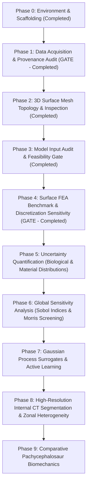

# Master Research & Implementation Plan: Stegoceras Biomechanics & Uncertainty Quantification

**Taxon**: *Stegoceras validum* Lambe, 1902  
**Taxonomic Lectotype**: **CMN 515** (Canadian Museum of Nature, Ottawa)  
**Study Specimen**: **UALVP 2** (University of Alberta Laboratory for Vertebrate Paleontology, Edmonton; an articulated, exceptionally preserved referred specimen comprising skull, mandible, and postcrania)  
**Primary Biomechanics Target**: Snively, E. & Theodor, J. M. (2011). *Common functional correlates of head-strike behavior in bovid artiodactyls and pachycephalosaurs*. PLoS ONE 6(6): e21412.  
**Core Scientific Question**: *How robust are conclusions about pachycephalosaur cranial biomechanics to uncertainty in geometry, material properties, loading conditions, and modeling assumptions?*

---

## 🏛️ 1. Project Overview & Scientific Guiding Principles

The objective of this project is to construct a fully reproducible, open-source computational biomechanics and uncertainty quantification (UQ) pipeline for *Stegoceras validum*. The project proceeds through systematic data ingestion, geometric validation, CT segmentation, analytical validation, finite-element reproduction, sensitivity analysis, and surrogate-based active learning.

### Core Methodological Principles

1. **Strict Provenance & Immutability**:
   Every raw scan, surface mesh, and reference model has documented provenance, repository ID, and licensing. Raw data are never altered in place.
2. **Explicit Uncertainty & Zero Fabrication**:
   Unknown parameters (e.g., in vivo keratin thickness, permineralization modulus inflation, non-preserved cartilage) are explicitly labeled `UNKNOWN` and modeled as probability distributions $\theta \sim p(\theta)$ rather than asserted as fixed constants. Uninspected meshes are marked `NOT_YET_INSPECTED`.
3. **Reproducibility Over Complexity**:
   A deterministic, transparent, and reproducible FEA benchmark is established and validated prior to deploying non-linear contacts, complex anisotropic tensors, or machine learning surrogates.
4. **Distinction of Uncertainty Sources**:
   Numerical discretization error (mesh convergence) is strictly separated from biological uncertainty (material properties, in vivo muscle force) and model-form uncertainty (boundary conditions).
5. **Phase Gating & State Architecture**:
   Each milestone serves as an explicit gate. Downstream simulation phases do not proceed without formal empirical validation. State and decisions are maintained hierarchically:
   - **Operational Entry Point**: [`HANDOFF.md`](file:///Users/michael/Library/CloudStorage/GoogleDrive-mdhornstein@gmail.com/My%20Drive/AA%20Projects/pachycephalosaurus-biomechanics/HANDOFF.md)
   - **Canonical Living State**: [`docs/CURRENT_STATE.md`](file:///Users/michael/Library/CloudStorage/GoogleDrive-mdhornstein@gmail.com/My%20Drive/AA%20Projects/pachycephalosaurus-biomechanics/docs/CURRENT_STATE.md)
   - **Decision Log**: [`docs/DECISIONS.md`](file:///Users/michael/Library/CloudStorage/GoogleDrive-mdhornstein@gmail.com/My%20Drive/AA%20Projects/pachycephalosaurus-biomechanics/docs/DECISIONS.md)
   - **Milestone Snapshots**: [`docs/snapshots/`](file:///Users/michael/Library/CloudStorage/GoogleDrive-mdhornstein@gmail.com/My%20Drive/AA%20Projects/pachycephalosaurus-biomechanics/docs/snapshots/)

---

## 🗺️ 2. Computational Roadmap

---

### Phase 0: Environment & Project Scaffolding *(Completed)*
- Deterministic Python 3.12 virtual environment managed by `uv`.
- Configured `pyproject.toml` with `hatchling` exposing editable `stegoceras_biomechanics` package.
- Clean directory hierarchy (`data/`, `literature/`, `notebooks/`, `src/`, `models/`, `simulations/`, `results/`, `reports/`).

### Phase 1: Data Acquisition & Provenance Manifest *(Infrastructure Complete - Gate)*
- Comprehensive inventory of public UALVP 2 digital records identified across MorphoSource, WitmerLab, and Sketchfab.
- Implementation of 4-tier provenance taxonomy (`primary_scan`, `segmented_from_primary_scan`, `researcher_derived`, `secondary_reference`).
- Machine-readable manifest [`data/metadata/dataset_manifest.yaml`](file:///Users/michael/Library/CloudStorage/GoogleDrive-mdhornstein@gmail.com/My%20Drive/AA%20Projects/pachycephalosaurus-biomechanics/data/metadata/dataset_manifest.yaml).
- Checksum validation and safe ingestion tooling (`scripts/ingest_data.py`).
- Publication of Phase 1 Synthesis Report ([`reports/phase1_data_and_geometry_report.md`](file:///Users/michael/Library/CloudStorage/GoogleDrive-mdhornstein@gmail.com/My%20Drive/AA%20Projects/pachycephalosaurus-biomechanics/reports/phase1_data_and_geometry_report.md)).

### Phase 2: Digital Anatomy Inventory & Geometry Validation *(Completed)*
- Ingested and inventoried 33 MorphoSource surface STLs (Whole Skull `000018284` + 32 Component Bones `000043121-000043162`).
- Generated quantitative inventory catalog [`data/metadata/geometry_inventory.csv`](file:///Users/michael/Library/CloudStorage/GoogleDrive-mdhornstein@gmail.com/My%20Drive/AA%20Projects/pachycephalosaurus-biomechanics/data/metadata/geometry_inventory.csv) with SHA-256 digests, vertex/face counts, and topology.
- Verified common native coordinate system alignment ($\Delta \le 0.029$ coordinate units) and zero-transformation assembly.
- Characterized 14 bilateral symmetry pairs and sampled nearest-point distance distributions.
- Published Phase 2 Synthesis Report ([`reports/phase2_digital_anatomy_report.md`](file:///Users/michael/Library/CloudStorage/GoogleDrive-mdhornstein@gmail.com/My%20Drive/AA%20Projects/pachycephalosaurus-biomechanics/reports/phase2_digital_anatomy_report.md)).

### Phase 3: Published-Model Input Audit & Biomechanical Feasibility *(Completed - Gate)*
- Line-by-line model parameter and methodology extraction from primary reference Snively & Theodor (2011) ([`literature/snively_theodor_2011_model_audit.md`](file:///Users/michael/Library/CloudStorage/GoogleDrive-mdhornstein@gmail.com/My%20Drive/AA%20Projects/pachycephalosaurus-biomechanics/literature/snively_theodor_2011_model_audit.md)).
- Constructed formal Biomechanics Input Matrix ([`data/metadata/biomechanics_input_matrix.csv`](file:///Users/michael/Library/CloudStorage/GoogleDrive-mdhornstein@gmail.com/My%20Drive/AA%20Projects/pachycephalosaurus-biomechanics/data/metadata/biomechanics_input_matrix.csv)) with 5-tier evidence levels and 7 availability categories.
- Reconstructed published computational workflow and separated geometry-limited, parameter-limited, and model-form uncertainties ([`reports/snively_theodor_model_reconstruction.md`](file:///Users/michael/Library/CloudStorage/GoogleDrive-mdhornstein@gmail.com/My%20Drive/AA%20Projects/pachycephalosaurus-biomechanics/reports/snively_theodor_model_reconstruction.md)).
- Formally justified that raw CT is NOT required for the first baseline benchmark, but required for voxel-level density mapping.
- Specified concrete first benchmark experiment with explicit quantitative validation targets ([`reports/phase3_recommended_benchmark.md`](file:///Users/michael/Library/CloudStorage/GoogleDrive-mdhornstein@gmail.com/My%20Drive/AA%20Projects/pachycephalosaurus-biomechanics/reports/phase3_recommended_benchmark.md)).
- Automated dimensional consistency audit notebook ([`notebooks/05_model_input_dimensional_audit.ipynb`](file:///Users/michael/Library/CloudStorage/GoogleDrive-mdhornstein@gmail.com/My%20Drive/AA%20Projects/pachycephalosaurus-biomechanics/notebooks/05_model_input_dimensional_audit.ipynb)).
- Automated verification tests ([`tests/test_phase3_model_audit.py`](file:///Users/michael/Library/CloudStorage/GoogleDrive-mdhornstein@gmail.com/My%20Drive/AA%20Projects/pachycephalosaurus-biomechanics/tests/test_phase3_model_audit.py)).

### Phase 4: Surface-Derived FEA Benchmark & Discretization Sensitivity *(Completed - Gate)*
- Immutable canonical master surface $G_0$ (`stegoceras_ualvp2_canonical_master.stl`, SHA-256 `5adcf5369626...`).
- Volumetric tetrahedral mesh hierarchy generated via TetGen with fixed quality ($q=1.5, \theta_{\min}=10^\circ$) and pure volume refinement:
  - Coarse ($h_1$): 422,573 tets
  - Med-Coarse ($h_2$): 540,310 tets
  - Medium ($h_3$): 825,277 tets
  - Fine ($h_4$): 1,389,116 tets (computational memory boundary on 16 GB workstation).
- Algorithmic single-component geodesic load patch on dorsal dome apex ($3000.0\text{ mm}^2$, $1000.0\text{ N}$) via dual-graph Dijkstra wavefront propagation (0% ventral penetration).
- Anatomical boundary restraints: Occipital condyle ($u_x = u_y = u_z = 0$) and nuchal crest ($u_y = u_z = 0$).
- 3D linear isotropic elasticity engine (`skfem` + SciPy) with direct sparse solves.
- Discretization sensitivity characterized and explicitly propagated as numerical uncertainty.
- 16/16 passing automated tests in [`tests/test_phase4_fea.py`](file:///Users/michael/Library/CloudStorage/GoogleDrive-mdhornstein@gmail.com/My%20Drive/AA%20Projects/pachycephalosaurus-biomechanics/tests/test_phase4_fea.py).
- Milestone Synthesis Report: [`reports/phase4_fea_benchmark_report.md`](file:///Users/michael/Library/CloudStorage/GoogleDrive-mdhornstein@gmail.com/My%20Drive/AA%20Projects/pachycephalosaurus-biomechanics/reports/phase4_fea_benchmark_report.md).

### Phase 5: Biological, Material, & Boundary Uncertainty Quantification *(Active Next Phase)*
- Propagate characterized numerical discretization uncertainty ($\epsilon_{\text{num}}$) alongside epistemic and aleatory inputs:
  - Bone Young's modulus $E \sim p(E)$ (mammalian/avian compact bone envelope: 10–22 GPa).
  - Poisson's ratio $\nu \sim p(\nu)$ (0.28–0.38).
  - Scale factor $s \sim \mathcal{U}(0.95, 1.05)$.
  - Contact patch area $A \sim \mathcal{U}(2500, 4000)\text{ mm}^2$.
  - Load inclination angle $\alpha \sim \mathcal{N}(0^\circ, 10^{\circ 2})$.
- Monte Carlo / Latin Hypercube Sampling (LHS) across parameter distributions.
- Quantify output distributions: dome apex stress, endocranial braincase safety margin, total strain energy.

### Phase 6: Global Sensitivity Analysis
- First-order ($S_i$) and total-order ($S_{Ti}$) Sobol sensitivity indices via SALib.
- Quantify variance decomposition: determine whether biological uncertainty (modulus, scale) or modeling choices (patch area, load angle) dominate cranial stress variance.

### Phase 7: Gaussian Process Surrogate Modeling & Active Learning
- Train Gaussian Process (GP) regression models on FE simulation ensembles.
- Evaluate surrogate predictive accuracy on held-out validation simulations ($R^2$, RMSE, interval calibration).
- Deploy active learning acquisition functions (Expected Improvement / Predictive Variance) for sample-efficient exploration.

### Phase 8: High-Resolution Internal CT Segmentation & Zonal Heterogeneity
- Semi-automated segmentation from primary micro-CT slices.
- Distinguish internal anatomical zones:
  - **Zone 1**: Deep compact bone surrounding braincase.
  - **Zone 2**: Vascular cancellous zone with radiating trabeculae.
  - **Zone 3**: Superficial dense compact bone of the dorsal dome.
- Segment endocranial cavity and neurovascular canals.
- Heterogeneous material property mapping from CT Hounsfield Units.

### Phase 9: Comparative Pachycephalosaur Biomechanics
- Expand validated UQ pipeline to comparative taxa:
  - *Acrotholus audeti*
  - *Prenocephale prenes*
  - *Homalocephale calathoceros* (flat-headed morphotype)
  - Extant artiodactyl analogues (*Ovibos moschatus*, *Ovis canadensis*).
