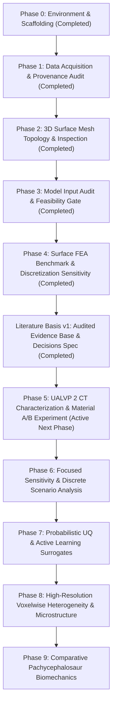

# Master Research & Implementation Plan: Stegoceras Biomechanics & Uncertainty Quantification

**Taxon**: *Stegoceras validum* Lambe, 1902  
**Taxonomic Lectotype**: **CMN 515** (Canadian Museum of Nature, Ottawa)  
**Study Specimen**: **UALVP 2** (University of Alberta Laboratory for Vertebrate Paleontology, Edmonton; an articulated, exceptionally preserved referred specimen comprising skull, mandible, and postcrania)  
**Primary Biomechanics Target**: Snively, E. & Theodor, J. M. (2011). *Common functional correlates of head-strike behavior in bovid artiodactyls and pachycephalosaurs*. PLoS ONE 6(6): e21412.  
**Core Scientific Question**: *How robust are conclusions about pachycephalosaur cranial biomechanics to uncertainty in geometry, material properties, loading conditions, and modeling assumptions?*

---

## 🏛️ 1. Project Overview & Scientific Guiding Principles

The objective of this project is to construct a fully reproducible, open-source computational biomechanics and uncertainty quantification (UQ) pipeline for *Stegoceras validum*. The project proceeds through systematic data ingestion, geometric validation, CT segmentation, analytical validation, finite-element reproduction, sensitivity analysis, and surrogate-based active learning.

### Core Methodological Principles

1. **Strict Provenance & Immutability**:
   Every raw scan, surface mesh, and reference model has documented provenance, repository ID, and licensing. Raw data are never altered in place.
2. **Explicit Uncertainty & Scenario Discipline**:
   Unknown parameters and model-form choices are explicitly classified and handled according to their mathematical nature (Model Decision Basis v1 D07, D16):
   - Continuous parameters with comparative literature support (e.g., tissue modulus ranges) are initially treated as bounded sensitivity envelopes. A probabilistic representation $\theta \sim p(\theta)$ requires scientific justification of the quantity and its distribution, and is never assumed a priori.
   - Discrete structural and boundary alternatives (homogeneous vs. zoned, rigid vs. compliant restraints) remain distinct scenario branches and are never smeared into continuous probability distributions.
   - Unknown biological features (e.g., unpreserved keratin thickness or cartilage) are explicitly labeled `UNKNOWN`. Uninspected meshes are marked `NOT_YET_INSPECTED`.
3. **Reproducibility Over Premature Complexity**:
   A deterministic, transparent, and reproducible FEA benchmark is established and numerically verified prior to deploying multi-zone material architectures, non-linear contacts, or surrogate modeling. Numerical verification is strictly separated from biological validation (D14).
4. **Distinction of Uncertainty Sources**:
   Numerical discretization error (mesh convergence) is strictly separated from biological uncertainty (material properties, in vivo muscle force) and model-form uncertainty (boundary conditions).
5. **Phase Gating & State Architecture**:
   Each milestone serves as an explicit gate. Downstream simulation phases do not proceed without formal empirical validation. State and decisions are maintained hierarchically:
   - **Operational Entry Point**: [`HANDOFF.md`](HANDOFF.md)
   - **Canonical Living State**: [`docs/CURRENT_STATE.md`](docs/CURRENT_STATE.md)
   - **Decision Log**: [`docs/DECISIONS.md`](docs/DECISIONS.md)
   - **Milestone Snapshots**: [`docs/snapshots/`](docs/snapshots/)

---

## 🗺️ 2. Computational Roadmap

---

### Phase 0: Environment & Project Scaffolding *(Completed)*
- Deterministic Python 3.12 virtual environment managed by `uv`.
- Configured `pyproject.toml` with `hatchling` exposing editable `stegoceras_biomechanics` package.
- Clean directory hierarchy (`data/`, `literature/`, `notebooks/`, `src/`, `models/`, `simulations/`, `results/`, `reports/`).

### Phase 1: Data Acquisition & Provenance Manifest *(Infrastructure Complete - Gate)*
- Comprehensive inventory of public UALVP 2 digital records identified across MorphoSource, WitmerLab, and Sketchfab.
- Implementation of 4-tier provenance taxonomy (`primary_scan`, `segmented_from_primary_scan`, `researcher_derived`, `secondary_reference`).
- Machine-readable manifest [`data/metadata/dataset_manifest.yaml`](data/metadata/dataset_manifest.yaml).
- Checksum validation and safe ingestion tooling (`scripts/ingest_data.py`).
- Publication of Phase 1 Synthesis Report ([`reports/phase1_data_and_geometry_report.md`](reports/phase1_data_and_geometry_report.md)).

### Phase 2: Digital Anatomy Inventory & Geometry Validation *(Completed)*
- Ingested and inventoried 33 MorphoSource surface STLs (Whole Skull `000018284` + 32 Component Bones `000043121-000043162`).
- Generated quantitative inventory catalog [`data/metadata/geometry_inventory.csv`](data/metadata/geometry_inventory.csv) with SHA-256 digests, vertex/face counts, and topology.
- Verified common native coordinate system alignment ($\Delta \le 0.029$ coordinate units) and zero-transformation assembly.
- Characterized 14 bilateral symmetry pairs and sampled nearest-point distance distributions.
- Published Phase 2 Synthesis Report ([`reports/phase2_digital_anatomy_report.md`](reports/phase2_digital_anatomy_report.md)).

### Phase 3: Published-Model Input Audit & Biomechanical Feasibility *(Completed - Gate)*
- Line-by-line model parameter and methodology extraction from primary reference Snively & Theodor (2011) ([`literature/snively_theodor_2011_model_audit.md`](literature/snively_theodor_2011_model_audit.md)).
- Constructed formal Biomechanics Input Matrix ([`data/metadata/biomechanics_input_matrix.csv`](data/metadata/biomechanics_input_matrix.csv)) with 5-tier evidence levels and 7 availability categories.
- Reconstructed published computational workflow and separated geometry-limited, parameter-limited, and model-form uncertainties ([`reports/snively_theodor_model_reconstruction.md`](reports/snively_theodor_model_reconstruction.md)).
- Formally justified that raw CT is NOT required for the first baseline benchmark, but required for voxel-level density mapping.
- Specified concrete first benchmark experiment with explicit quantitative validation targets ([`reports/phase3_recommended_benchmark.md`](reports/phase3_recommended_benchmark.md)).
- Automated dimensional consistency audit notebook ([`notebooks/05_model_input_dimensional_audit.ipynb`](notebooks/05_model_input_dimensional_audit.ipynb)).
- Automated verification tests ([`tests/test_phase3_model_audit.py`](tests/test_phase3_model_audit.py)).

### Phase 4: Surface-Derived FEA Benchmark & Discretization Sensitivity *(Completed - Gate)*
- Immutable canonical master surface $G_0$ (`stegoceras_ualvp2_canonical_master.stl`, SHA-256 `5adcf5369626...`).
- Volumetric tetrahedral mesh hierarchy generated via TetGen with fixed quality ($q=1.5, \theta_{\min}=10^\circ$) and pure volume refinement:
  - Coarse ($h_1$): 422,573 tets
  - Med-Coarse ($h_2$): 540,310 tets
  - Medium ($h_3$): 825,277 tets
  - Fine ($h_4$): 1,389,116 tets (computational memory boundary on 16 GB workstation).
- Algorithmic single-component geodesic load patch on dorsal dome apex ($3000.0\text{ mm}^2$, $1000.0\text{ N}$) via dual-graph Dijkstra wavefront propagation (0% ventral penetration).
- Anatomical boundary restraints: Occipital condyle ($u_x = u_y = u_z = 0$) and nuchal crest ($u_y = u_z = 0$).
- 3D linear isotropic elasticity engine (`skfem` + SciPy) with direct sparse solves.
- Discretization sensitivity characterized and explicitly propagated as numerical uncertainty.
- 17/17 passing automated tests in [`tests/test_phase4_fea.py`](tests/test_phase4_fea.py).
- Milestone Synthesis Report: [`reports/phase4_fea_benchmark_report.md`](reports/phase4_fea_benchmark_report.md).

### Literature Basis v1 & Model Decisions Specification *(Completed — Model Decision Basis v1)*
- Master literature synthesis ([`literature/stegoceras_biomechanics_literature_synthesis.md`](literature/stegoceras_biomechanics_literature_synthesis.md)), dossiers, and audit-to-correction ledger ([`literature/LITERATURE_CORRECTIONS.md`](literature/LITERATURE_CORRECTIONS.md)).
- Canonical bridge specification ([`docs/LITERATURE_TO_MODEL_DECISIONS.md`](docs/LITERATURE_TO_MODEL_DECISIONS.md)) codifying epistemic rules, a 17-decision register (D01–D17), 7 experimental gates (Gates A–G), volume-mesh representation discipline, and prohibited/allowed interpretations (prior draft preserved in [`docs/archive/`](docs/archive/)).

### Phase 5: UALVP 2 CT Characterization & Material A/B Experiment *(Active Next Phase)*
- **CT Characterization Gate**:
  1. Ingest and cryptographically verify the primary 514-slice UALVP 2 micro-CT DICOM volume ($0.210 \times 0.210 \times 0.250\text{ mm}$).
  2. Verify physical scale and spatial coordinate registration against the canonical surface mesh ($G_0$).
  3. Characterize image data semantics: pixel dynamic range, rock matrix vs. bone attenuation contrast, beam-hardening artifacts, and internal canal network visibility.
  4. Reconstruct published material inference logic from Snively & Theodor (2011).
- **Decisive Material A/B Experiment**:
  - Implement **Model B** (histology/anatomy-informed 3-zone candidate baseline with stiffness-contrast sensitivity sweep).
  - Solve Model A vs. Model B on identical volume mesh topology ($G_0$), loads ($3000\text{ mm}^2$, $1000\text{ N}$), and boundary conditions via elementwise material assignment.
  - Determine whether evidence-based internal material architecture materially alters compliance, strain-energy partitioning, and stress transmission/redistribution to the endocranial braincase.

### Phase 6: Focused Sensitivity & Discrete Scenario Analysis
- Structured scenario families over candidate design envelopes: impact inclination angle ($\alpha \in [0^\circ, 20^\circ]$), contact patch variation ($A \in [2500, 4000]\text{ mm}^2$ / $500\text{--}3000\text{ mm}^2$), and lateral strike placement — to be finalized after CT/geometry characterization.
- Cervical boundary compliance: distributed elastic spring foundations vs. rigid condylar fixity.
- Closed-form analytical scaling for force magnitude $F$ and base modulus $E$ (avoiding redundant 3D FE solves).

### Phase 7: Probabilistic Uncertainty Quantification & Surrogate Modeling
- Parameter distributions strictly for continuous variables that have empirical literature support and cannot be factored out analytically.
- Problem-scaled sampling design (LHS / Sobol variance decomposition) sized to problem dimensionality and solve costs after Phase 5/6, without precommitting to arbitrary sample sizes (D16).
- Surrogate modeling (Gaussian Processes / Polynomial Chaos) deployed only if full 3D solves prove computationally prohibitive for the required sample size.

### Phase 8: High-Resolution Voxelwise Heterogeneity & Microstructure
- Continuous density-stiffness mapping $E(\text{HU})$ with beam-hardening corrections.
- Representation of vertical/radial vascular canal networks (Nirody et al. 2022) and localized stress concentrations.

### Phase 9: Comparative Pachycephalosaur Biomechanics
- Expand validated pipeline across comparative taxa (*Acrotholus audeti*, *Prenocephale prenes*, *Homalocephale calathoceros*, *Ovibos moschatus*, *Ovis canadensis*).

