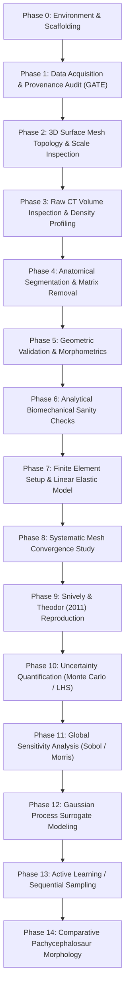

# Master Research & Implementation Plan: Stegoceras Biomechanics & Uncertainty Quantification

**Taxon**: *Stegoceras validum* Lambe, 1902  
**Taxonomic Lectotype**: **CMN 515** (Canadian Museum of Nature, Ottawa)  
**Study Specimen**: **UALVP 2** (University of Alberta Laboratory for Vertebrate Paleontology, Edmonton; an articulated, exceptionally preserved referred specimen comprising skull, mandible, and postcrania)  
**Primary Biomechanics Target**: Snively, E. & Theodor, J. M. (2011). *Common functional correlates of head-strike behavior in bovid artiodactyls and pachycephalosaurs*. PLoS ONE 6(6): e21412.  
**Core Scientific Question**: *How robust are conclusions about pachycephalosaur cranial biomechanics to uncertainty in geometry, material properties, loading conditions, and modeling assumptions?*

---

## 🏛️ 1. Project Overview & Scientific Guiding Principles

The objective of this project is to construct a fully reproducible, open-source computational biomechanics and uncertainty quantification (UQ) pipeline for *Stegoceras validum*. The project proceeds through systematic data ingestion, geometric validation, CT segmentation, analytical validation, finite-element reproduction, sensitivity analysis, and surrogate-based active learning.

### Core Methodological Principles

1. **Strict Provenance & Immutability**:
   Every raw scan, surface mesh, and reference model has documented provenance, repository ID, and licensing. Raw data are never altered in place.
2. **Explicit Uncertainty & Zero Fabrication**:
   Unknown parameters (e.g., in vivo keratin thickness, permineralization modulus inflation, non-preserved cartilage) are explicitly labeled `UNKNOWN` and modeled as probability distributions $\theta \sim p(\theta)$ rather than asserted as fixed constants. Uninspected meshes are marked `NOT_YET_INSPECTED`.
3. **Reproducibility Over Complexity**:
   A deterministic, transparent, and reproducible FEA benchmark is established and validated prior to deploying non-linear contacts, complex anisotropic tensors, or machine learning surrogates.
4. **Distinction of Uncertainty Sources**:
   Numerical discretization error (mesh convergence) is strictly separated from biological uncertainty (material properties, in vivo muscle force) and model-form uncertainty (boundary conditions).
5. **Phase Gating**:
   Each milestone serves as an explicit gate. Downstream simulation phases do not proceed without formal empirical validation and review of upstream data and geometry.

---

## 🗺️ 2. Comprehensive 18-Phase Computational Roadmap

---

### Phase 0: Environment & Project Scaffolding *(Completed)*
- Deterministic Python 3.12 virtual environment managed by `uv`.
- Configured `pyproject.toml` with `hatchling` exposing editable `stegoceras_biomechanics` package.
- Clean directory hierarchy (`data/`, `literature/`, `notebooks/`, `src/`, `models/`, `simulations/`, `results/`, `reports/`).

### Phase 1: Data Acquisition & Provenance Manifest *(Infrastructure Complete - Gate)*
- Comprehensive inventory of public UALVP 2 digital records identified across MorphoSource, WitmerLab, and Sketchfab.
- Implementation of 4-tier provenance taxonomy (`primary_scan`, `segmented_from_primary_scan`, `researcher_derived`, `secondary_reference`).
- Machine-readable manifest [`data/metadata/dataset_manifest.yaml`](file:///Users/michael/Library/CloudStorage/GoogleDrive-mdhornstein@gmail.com/My%20Drive/AA%20Projects/pachycephalosaurus-biomechanics/data/metadata/dataset_manifest.yaml).
- Checksum validation and safe ingestion tooling (`scripts/ingest_data.py`).
- Publication of Phase 1 Synthesis Report ([`reports/phase1_data_and_geometry_report.md`](file:///Users/michael/Library/CloudStorage/GoogleDrive-mdhornstein@gmail.com/My%20Drive/AA%20Projects/pachycephalosaurus-biomechanics/reports/phase1_data_and_geometry_report.md)).

### Phase 2: Inspection of Existing 3D Geometry
- Ingest and inspect available 3D surface models using `trimesh`, `pyvista`, and `meshio`.
- Verify topological manifoldness: watertight status, self-intersections, non-manifold edges/vertices, degenerate faces.
- Audit physical coordinate frame and scale ($mm$ vs. $cm$ vs. $m$) by comparing bounding dimensions against published anatomical measurements.
- Extract surface area, bounding box, volume, and Euler characteristic $\chi = V - E + F$.
- Export sanitized baseline copies to `data/meshes/cleaned/` without modifying raw source geometry.

### Phase 3: Raw CT Volume & Density Inspection
- Ingest DICOM slice stacks using `SimpleITK` and `pydicom`.
- Document scan metadata: slice thickness, pixel spacing, acquisition matrix, field of view, kVp/mA, bit depth, and Hounsfield unit calibration directly from DICOM tags.
- Generate orthogonal multi-planar reconstructions (axial, coronal, sagittal).
- Compute density histograms across anatomical subregions (dome apex, supratemporal fenestrae, palate, basicranium) to assess beam-hardening artifacts and mineral infilling.

### Phase 4: Cranial Segmentation & Cavity Isolation
- Semi-automated segmentation in 3D Slicer / SimpleITK.
- Distinguish internal anatomical zones:
  - **Zone 1**: Deep compact bone surrounding braincase.
  - **Zone 2**: Vascular cancellous zone with radiating trabeculae.
  - **Zone 3**: Superficial dense compact bone of the dorsal dome.
- Segment and hollow out the endocranial cavity and neurovascular canals (which exit onto the cranial roof).
- Maintain complete audit logs of manual thresholding and sculpting operations.

### Phase 5: Geometry Validation & Comparative Morphometrics
- Register CT-derived segmented geometry against published 3D surface meshes (ICP / Hausdorff distance).
- Quantify skull length, width, dome apex height, and cortical thickness profiles.
- Analyze structural discrepancies between CT reconstructions and external 3D models.

### Phase 6: Analytical Pre-FEA Biomechanics
- Formulate 2D and 3D analytical beam/dome models before running numerical solvers.
- Calculate cranial lever arms, out-lever ratios, and equilibrium force balances under dome impact.
- Identify physically impossible parameter combinations, scale errors, or unit mismatches.

### Phase 7: Deterministic Finite Element Model Setup
- Evaluate and select open-source FEA solver backend (**CalculiX** vs. **FEBio**).
- Solid tetrahedral meshing with linear/quadratic elements ($C3D4$ / $C3D10$).
- Baseline material assignments:
  - Compact cortical bone: $E = 10 - 18\text{ GPa}$, $\nu = 0.30$, $\rho = 2000\text{ kg/m}^3$.
  - Trabecular/cancellous bone: $E = 1.0\text{ GPa}$, $\nu = 0.30$.
  - Keratin pad (when modeled): $E = 3.9\text{ GPa}$, $\nu = 0.28$, $\rho = 1300\text{ kg/m}^3$.
- Boundary conditions: Full displacement/rotation restraint at the occipital condyle; distributed spring/fixed constraints along the nuchal crest simulating dorsal neck musculature (*m. transversospinalis capitis* / *m. complexus*).
- Static compressive load: $F = 1360\text{ N}$ applied to the dome apex.

### Phase 8: Systematic Mesh Convergence
- Generate multiple mesh resolutions (coarse, medium, fine, ultra-fine).
- Compute convergence curves for:
  - Maximum von Mises stress $\sigma_{vM}$.
  - Peak principal strains ($\epsilon_1, \epsilon_3$).
  - Strain energy density $U$.
  - Basicranial reaction forces.
- Establish the discretization asymptotic region before interpreting stress maps.

### Phase 9: Benchmark Reproduction (*Snively & Theodor 2011*)
- Reproduce the 1360 N dome apex load simulation.
- Compare predicted von Mises stress distribution (diffuse 1–5 MPa throughout internal cancellous bone, peak 8–46 MPa near geometric concentrators) against published figures (Figures 12 & 13 in Snively & Theodor 2011).
- Classify differences into geometric, segmentation, material, or constraint origins.

### Phase 10: Uncertainty Quantification (UQ)
- Define parameter distributions $\mathbf{\theta} \sim p(\mathbf{\theta})$:
  - Cortical Young's modulus $E_{cort} \sim \mathcal{U}(10, 22)\text{ GPa}$
  - Cancellous Young's modulus $E_{canc} \sim \mathcal{U}(0.5, 4.5)\text{ GPa}$
  - Poisson's ratio $\nu \sim \mathcal{U}(0.25, 0.35)$
  - Keratin modulus $E_{ker} \sim \mathcal{U}(1.5, 5.0)\text{ GPa}$
  - Impact force magnitude $F \sim \mathcal{N}(1360, 200^2)\text{ N}$
  - Impact vector inclination angle $\alpha \sim \mathcal{N}(0^\circ, 10^{\circ 2})$
  - Keratin pad thickness $t_{ker} \sim \mathcal{U}(2, 15)\text{ mm}$
- Execute Latin Hypercube Sampling (LHS) across parameter space.
- Quantify output response distributions: peak stress, strain energy, braincase safety factors.

### Phase 11: Global Sensitivity Analysis
- Compute first-order ($S_i$) and total-order ($S_{Ti}$) Sobol sensitivity indices via SALib.
- Determine which biological and modeling assumptions dominate mechanical output variance.

### Phase 12: Gaussian Process Surrogate Modeling
- Train Gaussian Process (GP) regression models on FE simulation ensembles.
- Evaluate surrogate predictive accuracy on held-out test simulations ($R^2$, RMSE, interval calibration).

### Phase 13: Active Learning & Sequential Experimental Design
- Implement sequential acquisition functions (Predictive Variance / Expected Improvement).
- Quantify reduction in required FEA solver runs to achieve targeted predictive fidelity across parameter space.

### Phase 14: Comparative Pachycephalosaur Morphology
- Expand validated pipeline to comparative taxa:
  - *Acrotholus audeti* (DigiMorph CT data)
  - *Prenocephale prenes*
  - *Homalocephale calathoceros* (flat-headed morphotype)
  - Extant combative analogues (*Cephalophus leucogaster*, *Ovibos moschatus*, *Ovis canadensis*).
