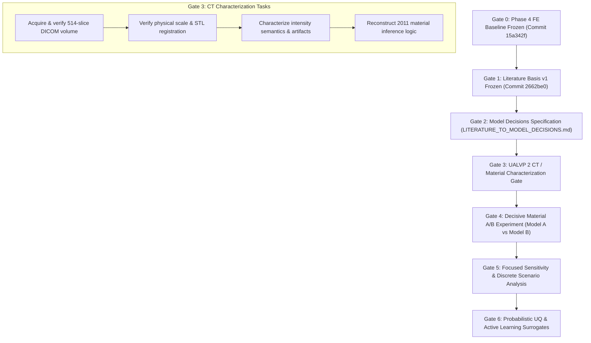

# Literature-to-Model Decisions Specification

**Document Role**: Scientific Requirements & Bridge Specification  
**Status**: ACTIVE STANDARD (Model Decision Basis v1)  
**Baseline Anchor**: Commit `2662be0` (`literature/stegoceras_biomechanics_literature_synthesis.md`)  
**Target Codebase**: `src/stegoceras_biomechanics/fea/`, `models/`, `simulations/`, `PLAN.md`  

---

## 🏛️ 1. Purpose & Scope

This specification translates the 600-line canonical literature synthesis ([`stegoceras_biomechanics_literature_synthesis.md`](../literature/stegoceras_biomechanics_literature_synthesis.md)), the specialist dossiers, and the independent audit ledger ([`LITERATURE_CORRECTIONS.md`](../literature/LITERATURE_CORRECTIONS.md)) into **concrete, non-negotiable requirements** for the computational biomechanics and uncertainty quantification (UQ) program.

It establishes the formal bridge between historical paleobiological evidence and executable finite-element code, defining:
1. **The Epistemic Invariants**: Hard rules governing what simulations can and cannot claim.
2. **The Master Translation Matrix**: Direct mappings from literature findings to model implications, required experiments, and allowed interpretations.
3. **The Material Model Hierarchy**: The staged progression from our frozen homogeneous baseline (Model A) to biologically informed internal architecture.
4. **The Revised Computational Roadmap**: The explicit sequence of computational gates prioritizing direct CT/material characterization over unmotivated sampling campaigns.

```
                         THE SCIENTIFIC REQUIREMENTS PIPELINE

    ┌──────────────────────────┐
    │   Literature Basis v1    │  Traceable, audited historical evidence base
    │     (Commit 2662be0)     │  (Synthesis, dossiers, audit-to-correction ledger)
    └─────────────┬────────────┘
                  │
                  ▼
    ┌──────────────────────────┐
    │  LITERATURE-TO-MODEL     │  THIS SPECIFICATION: Translates findings into
    │  DECISIONS SPECIFICATION │  mathematical invariants, model implications,
    │ (LITERATURE_TO_MODEL_... │  and required computational experiments
    └─────────────┬────────────┘
                  │
                  ▼
    ┌──────────────────────────┐
    │  UALVP 2 CT / Material   │  Empirical characterization of the 514-slice
    │   Characterization Gate  │  DICOM volume (scale, intensity semantics, zonation)
    └─────────────┬────────────┘
                  │
                  ▼
    ┌──────────────────────────┐
    │ Decisive A/B Experiment  │  Model A (Homogeneous) vs. Model B (Zonated)
    │ (Material Heterogeneity) │  under identical geometry, loads, and BCs
    └─────────────┬────────────┘
                  │
                  ▼
    ┌──────────────────────────┐
    │   Focused Sensitivity    │  Controlled discrete load-case families
    │    & Scenario Analysis   │  and analytical parameter scaling
    └─────────────┬────────────┘
                  │
                  ▼
    ┌──────────────────────────┐
    │     Probabilistic UQ     │  Targeted distribution propagation and
    │   & Surrogate Modeling   │  surrogates conditional on actual cost/dimensionality
    └──────────────────────────┘
```

---

## ⚖️ 2. Core Epistemic Invariants & Methodological Rules

Every model, simulation script, and interpretation in this repository must strictly obey four foundational rules derived from the literature audit:

### Rule 1: Separation of Evidence, Model Parameter, and Fossil Assumption
$$\text{Literature Evidence} \longrightarrow \text{Plausible Range} \longrightarrow \text{Chosen Model Parameter} \longrightarrow \text{Unproven Fossil Assumption}$$
- Comparative literature informs plausible vertebrate skeletal property envelopes (e.g., cortical modulus $E \in [10, 25]\text{ GPa}$, cancellous modulus $E \in [0.5, 5.0]\text{ GPa}$).
- From those plausible ranges, specific numerical values (such as our Phase 4 baseline $E = 17.0\text{ GPa}$ or prior literature values) are selected as **project model parameters**.
- Every selected value remains an **explicit modeling assumption** for the fossil specimen, not an experimentally established physical measurement.

### Rule 2: Strict Boundary Between Verification and Validation
- **Numerical Verification**: Mesh convergence ($h$-refinement), grid convergence index (GCI) reporting, and patch tests measure *discretization error and solver accuracy*. Passing numerical verification proves the discrete mathematical equations are solved correctly; it provides **zero evidence** that the model accurately represents living dinosaur biology.
- **Cross-Study Benchmark Reproduction**: Replicating an earlier computational result (e.g., Snively & Theodor 2011) establishes *code repeatability and benchmark consistency*; it does **not** validate living stress fields.
- **Physical Validation**: In the absence of in vivo strain-gauge or force transducer measurements from living pachycephalosaurs (which are impossible), computational models can establish **comparative functional competence under specified hypotheses**, but **cannot** establish absolute biological ground-truth validation.

### Rule 3: Exploitation of Closed-Form Analytical Scaling
In linear isotropic elasticity on a fixed geometry with proportional boundary conditions:
- Nodal displacements scale linearly with force and inversely with modulus: $\mathbf{u}(c_F F, c_E E) = \frac{c_F}{c_E} \mathbf{u}(F, E)$.
- Cauchy and von Mises stresses scale linearly with force and are **completely independent of modulus**: $\boldsymbol{\sigma}(c_F F, c_E E) = c_F \boldsymbol{\sigma}(F, E)$.
- Total strain energy scales quadratically with force and inversely with modulus: $U(c_F F, c_E E) = \frac{c_F^2}{c_E} U(F, E)$.

**Computational Invariant**: Do **not** spend numerical simulation budgets repeatedly solving 3D finite-element systems solely to sample load magnitude $F$ or scalar modulus $E$ in a homogeneous linear model. These variations must be evaluated via closed-form analytical factorization. Numerical solves are reserved exclusively for variations that alter the structure of the stiffness matrix $\mathbf{K}$ (Poisson's ratio $\nu$, material zonation contrast, load orientation $\alpha$, contact patch area $A$, boundary spring compliance, and geometry).

### Rule 4: Uncertainty Taxonomy & Representation Discipline
Uncertainties must be categorized and handled according to their mathematical nature:
1. **Numerical Discretization Discrepancy ($\epsilon_{\text{num}}$)**: The observed output spread across mesh tiers ($h_1, h_2, h_3, h_4$). Must be reported as a deterministic numerical bounded interval, never treated as a random physical distribution.
2. **Parametric Sensitivity Envelopes**: Continuous parameters with empirical support from extant vertebrate literature (e.g., tissue modulus contrast, Poisson's ratio). Evaluated via bounded intervals or supported probability distributions.
3. **Discrete Model-Form Scenario Branches**: Structural, topological, and qualitative modeling alternatives (homogeneous vs. zonated; rigid condyle vs. cervical spring bed; static vs. dynamic). Because these lack an objective continuous probability measure, they **must be evaluated as discrete scenario branches and never smeared into arbitrary probability distributions**.

---

## 🗺️ 3. Master Literature-to-Model Translation Matrix

The following table formalizes the translation from canonical literature findings into computational model decisions:

| Literature Finding & Provenance | Scientific Claim | Model Implication | Required Action / Experiment | Allowed Interpretation | Prohibited Interpretation |
|---|---|---|---|---|---|
| **Internal Cranial Architecture**<br>Histological evidence (Goodwin & Horner 2004) identified three histological zones in a subadult pachycephalosaurid, showing that vascularity and tissue organization remodel through ontogeny; micro-CT quantification (Nirody et al. 2022) demonstrates internal vascularity differences in an ontogenetic series of *Stegoceras*. [BIO-05, BIO-07, BIO-13] | Internal anatomical heterogeneity is well supported by histology and micro-CT; an anatomically informed heterogeneous mechanical model is justified as an experimental hypothesis to test. | Model A (homogeneous isotropic) is strictly a baseline control to isolate geometric effects; heterogeneous models are scientifically motivated hypotheses to evaluate. | Acquire UALVP 2 DICOM volume; build explicit material hierarchy (Models A $\to$ B $\to$ C $\to$ D); execute decisive Model A vs. Model B A/B experiment under identical mesh, loads, and BCs. | Quantifies the mechanical sensitivity of compliance, strain-energy distribution, and stress transmission to an anatomically informed internal trabecular/cortical zonation hypothesis. | Claiming Model A represents living tissue mechanics, or asserting that UALVP 2 has a proven static three-engineering-material structure or that dome homogeneity is biologically defensible. |
| **Permineralization & Constitutive Parameters**<br>Living fossil bone properties cannot be measured directly. Extant vertebrate compact bone spans $E \in [10, 25]\text{ GPa}$; cancellous bone spans $E \in [0.5, 5.0]\text{ GPa}$. [FE-11, BIO-07] | Living tissue elasticity is fundamentally unmeasurable; literature bounds define plausible constitutive envelopes. | Specific modulus values (including $E = 17.0\text{ GPa}$) are chosen project modeling parameters, not specimen measurements. | Factor out scalar $E$ analytically for homogeneous runs; evaluate bounded sensitivity over stiffness contrast ratio ($E_{\text{cortex}} / E_{\text{core}}$) in heterogeneous models. | Evaluating structural sensitivity across the range of plausible vertebrate skeletal stiffnesses. | Asserting that $E = 17.0\text{ GPa}$ was measured for UALVP 2 by Snively & Theodor (2011) or represents an established biological constant for *Stegoceras*. |
| **CT Attenuation & Beam Hardening**<br>CT numbers reflect taphonomic mineral infill and potential beam hardening, not living tissue densities. Very high CT values, including values above 2500 HU, were treated cautiously in the published UALVP 2 material assignment because beam-hardening artifacts could inflate apparent density. [BIO-07, CT-06, FE-20] | Hounsfield Units (HU) cannot be directly equated to bone mineral density or living elastic modulus. Capping high values is a modeling correction based on an imaging-artifact hypothesis, not proof that every >2500 HU voxel is an artifact. | Raw CT HU cannot simply be converted into $E(\mathbf{x})$ via clinical empirical power laws without explicit calibration and sensitivity analysis. | Audit the UALVP 2 DICOM volume: quantify intensity distributions, evaluate beam-hardening signatures, inspect rock matrix vs. bone contrast, and establish density segmentation thresholds. | Using CT attenuation as an anatomical guide to internal spatial boundaries, canal orientations, and relative porosity. | Automated conversion of uncalibrated fossil HU to living elastic modulus, or asserting that CT numbers directly measure living tissue properties. |
| **Loading Kinematics & Contact Diversity**<br>Agonistic combat across extant taxa (Woodruff & Ackermans 2026) exhibits diverse contact surfaces, angles, velocities, and striking kinematics. [BIO-06, BIO-07, BIO-09] | "Headbutting" encompasses multiple distinct biomechanical events; load angle and contact patch are uncertain. | A single canonical normal load case is insufficient to characterize mechanical response across plausible loading scenarios (the published 1360 N case is a literature benchmark to potentially reproduce, distinct from our Phase 4 canonical 1000 N baseline). | Define a structured family of discrete load cases (normal strike, oblique $10^\circ\text{--}20^\circ$ strike, lateral/flank impact) over candidate design envelopes ($A \in [2500, 4000]\text{ mm}^2$ or $500\text{--}3000\text{ mm}^2$) — to be finalized after CT/geometry characterization. | Testing whether the cranial architecture is mechanically robust across diverse plausible loading scenarios. | Treating 1360 N as an observed biological impact force (rather than a literature benchmark), or treating candidate design envelopes ($A \in [2500, 4000]\text{ mm}^2$, $\alpha \in [0^\circ, 20^\circ]$) as literature-established biological distributions. |
| **Cervical Restraint & Boundary Compliance**<br>UALVP 2 postcranial myology indicates pelvic and axial stabilization (Moore et al. 2022); living atlanto-occipital joints possess compliance. [BIO-07, BIO-10, FE-06] | Rigid condylar fixity produces artificial numerical stress singularities not present in living animals. | Rigid constraints serve as benchmark boundary conditions, but over-constrain the basicranium and distort local stresses. | Evaluate discrete boundary condition models: (1) rigid condyle + nuchal restraint (benchmark), (2) distributed elastic cervical spring bed. Deprioritize point stress singularities near constraints. | Analyzing load path transmission into the postcranial skeleton and assessing boundary compliance sensitivity. | Interpreting localized stress peaks at rigid constraint nodes as biological failure, or treating rigid fixity as representative of living cervical kinematics. |
| **Discretization Sensitivity & Stress Metrics**<br>FEA verification literature proves that local peak stresses at singular points do not converge with mesh refinement. [FE-10, CT-09, FE-18] | Local peak von Mises stress is dominated by boundary artifacts and geometry singularities, not biological truth. | Point maximum stress cannot serve as the primary convergence or biological evaluation endpoint. | Use volume-averaged strain energy ($U$), global compliance, landmark displacements, and 95th-percentile regional stresses as primary quantities of interest (QoIs). | Demonstrating numerical convergence of energy and macro-scale load distribution pathways. | Using localized peak point stress to infer fracture initiation or skull failure. |
| **Mathematical Linearity & Scaling Efficiency**<br>Linear elasticity satisfies closed-form scaling under proportional loading: $\mathbf{u} \propto F/E$, $\boldsymbol{\sigma} \propto F$, $U \propto F^2/E$. | Simulating multiple force magnitudes or modulus scalings on a linear homogeneous model yields zero new mathematical information. | Repeated 3D finite-element solves over scalar $F$ and $E$ are computationally redundant and wasteful. | Factor out $F$ and $E$ analytically. Dedicate numerical solver runs strictly to parameters that alter the system stiffness matrix $\mathbf{K}$ (geometry, $\nu$, zonation, BCs, load orientation). | Exact analytical propagation of force and modulus variation across all linear outputs. | Spending computational or cluster budgets on brute-force Monte Carlo sampling over $F$ and $E$ in linear models. |
| **Discrete Model-Form Alternatives vs. UQ**<br>Structural modeling alternatives (homogeneous vs. zoned; rigid vs. spring BCs) lack continuous probability measures. [UQ-05, UQ-07, UQ-16] | Smearing discrete model choices into continuous probability distributions creates scientifically uninterpretable averages. | Model-form choices must be explored as discrete comparative branches, not collapsed into Monte Carlo distributions. | Formulate model-form alternatives as discrete scenario branches; restrict continuous probability distributions strictly to continuous parameters with empirical literature support. | Comparing the mechanical consequences of distinct biological or physical hypotheses. | Assigning arbitrary probability distributions over discrete structural models or boundary formulations. |
| **Biomechanical Competence vs. Behavioral Fact**<br>Biomechanical literature establishes capability under modeled conditions, not historical occurrence (Goodwin & Horner 2004; Woodruff & Ackermans 2026). [BIO-05, BIO-08, BIO-09, BIO-11] | Mechanical capability does not prove that an animal engaged in a specific behavior. | FEA results cannot "prove" that *Stegoceras* engaged in head-to-head combat or establish living safety factors. | Frame all conclusions in terms of comparative mechanical competence, stress distribution pathways, and structural performance under competing hypotheses (combat, display, feeding trade-offs). | Establishing whether the hypertrophied dome was structurally competent to dissipate impact energy without high braincase strain. | Claiming that finite element simulations prove the occurrence of headbutting or refute display/social recognition hypotheses. |

---

## 🏗️ 4. Computational Architecture & Material Hierarchy

To transition from the surface-derived baseline to biological realism without conflating variables, the repository enforces an explicit **4-tier material modeling hierarchy**:

```
                       MATERIAL MODELING PROGRESSION

    ┌────────────────────────────────────────────────────────┐
    │ Model A: Homogeneous Isotropic Compact Bone Baseline   │
    │ • Geometry: Watertight canonical surface G0            │  [COMPLETED]
    │ • Material: E = 17.0 GPa, ν = 0.30                     │  Phase 4 Freeze
    │ • Purpose: Numerical verification & baseline control   │
    └───────────────────────────┬────────────────────────────┘
                                │
                                ▼
    ┌────────────────────────────────────────────────────────┐
    │ Model B: Histology-Informed Anatomical Zonation        │
    │ • Zone 1 (Outer Cortex): Candidate compact bone        │  [ACTIVE NEXT GATE]
    │   baseline (E_nom = 17.0 GPa; range 10–25 GPa)         │  Decisive A/B Test
    │ • Zone 2 (Intermediate Core): Candidate trabecular core│  Model A vs. Model B
    │   baseline (E_nom = 2.5 GPa; range 0.5–5.0 GPa, ν=0.30)│  plus contrast sweep
    │ • Zone 3 (Deep Base): Candidate compact basicranium    │
    │   baseline (E_nom = 17.0 GPa)                          │
    │ • Sensitivity: Explicit stiffness-contrast sweep       │
    │   (E_cortex / E_core ratio)                            │
    │ • Purpose: Test structural effect of internal zonation │
    └───────────────────────────┬────────────────────────────┘
                                │
                                ▼
    ┌────────────────────────────────────────────────────────┐
    │ Model C: CT-Informed Continuous/Voxelwise Heterogeneity│
    │ • Direct mapping from audited UALVP 2 DICOM volume     │  [PHASE 8]
    │ • Thresholded Hounsfield Units with artifact masking   │  Voxel-level
    │ • Continuous density-stiffness relation E(HU)          │  heterogeneity
    │ • Purpose: High-resolution anatomical fidelity         │
    └───────────────────────────┬────────────────────────────┘
                                │
                                ▼
    ┌────────────────────────────────────────────────────────┐
    │ Model D: Anisotropic / Microstructural Formulation     │
    │ • Orthotropic radial trabecular orientation            │  [CONDITIONAL]
    │ • Explicit vascular canal geometry (Nirody et al. 2022)│  Triggered only if
    │ • Purpose: Advanced microstructural mechanics          │  Model B/C requires it
    └────────────────────────────────────────────────────────┘
```

#### Model B Definition & Baseline Moduli Demotion
Model B represents an anatomy- and histology-informed zonation hypothesis with a preregistered candidate baseline material contrast selected from documented vertebrate literature, combined with a separate stiffness-contrast sensitivity experiment ($E_{\text{cortex}}/E_{\text{core}}$):
- **Candidate Baseline Moduli**: Outer cortex $E_{\text{cortex}} = 17.0\text{ GPa}$, cancellous/trabecular core $E_{\text{core}} = 2.5\text{ GPa}$ (nominal baseline within the plausible $0.5\text{--}5.0\text{ GPa}$ range), basicranium $E_{\text{base}} = 17.0\text{ GPa}$, $\nu = 0.30$. These numerical values are candidate engineering baselines for the experiment, not direct measurements of UALVP 2 tissue.
- **Stiffness-Contrast Sensitivity Sweep**: A structured sweep over the contrast ratio ($E_{\text{cortex}}/E_{\text{core}} \in [2, 34]$) is required to determine whether biomechanical findings depend on the *existence of internal structural heterogeneity* versus the *specific numerical moduli chosen for that heterogeneity*.

### The Decisive A/B Experiment Specification
The immediate scientific priority is **not** a high-dimensional probabilistic UQ sweep, but the direct empirical test:
> **Does internal material zonation materially alter cranial compliance, strain-energy distribution, and stress transmission to the endocranial braincase relative to our frozen homogeneous baseline (Model A)?**

**Experiment Protocol**:
1. **Geometry Invariant**: Both models execute on the exact same canonical surface mesh ($G_0$).
2. **Loading Invariant**: Identical $3,000\text{ mm}^2$ dorsal apex load patch, identical $1,000\text{ N}$ total force magnitude, identical normal orientation.
3. **Boundary Invariant**: Identical rigid occipital condyle and nuchal crest constraints.
4. **Primary Comparison Quantities of Interest (QoIs)**:
   - Total strain energy ($U_{\text{tot}}$) and compliance shift.
   - Strain energy partition ($U_{\text{core}} / U_{\text{cortex}}$) within the internal dome.
   - Endocranial braincase 95th-percentile von Mises stress ($\sigma_{\text{braincase}}^{95}$) and regional stress transmission patterns.
   - Peak skull displacement ($\|\mathbf{u}\|_{\max}$).

### Internal Material Interface & Volume-Mesh Representation
A critical finite-element requirement for the Model A vs. Model B experiment is isolating biological material effects from numerical discretization artifacts:

$$\Delta \text{QoI} = \Delta_{\text{material}} + \Delta_{\text{discretization}}$$

To ensure that $\Delta_{\text{discretization}} = 0$ in the primary A/B comparison:
1. **Identical Volume Mesh Topology ($G_0$)**: Model B must initially be solved on the **exact same tetrahedral volume mesh** as Model A ($h_3$ tier, 825,277 elements, sharing identical node coordinates, element connectivity, contact patch nodes, and boundary constraint DOFs).
2. **Elementwise Spatial Material Assignment**: The internal zones (cortex, trabecular core, basicranium) are represented via **elementwise material tagging** on the existing mesh (assigning property tensors $(E_e, \nu_e)$ to each element $e$ based on anatomical coordinate bounding surfaces or voxel centroid queries from the registered CT volume).
3. **Decoupling Discretization Discrepancy**: If an explicit conforming multi-domain mesh with sharp geometric internal boundary surfaces is subsequently introduced, any numerical discretization discrepancy resulting from remeshing must be characterized and reported separately, preventing remeshing errors from being misattributed to biological architecture.

### Evaluation Criteria & QoI Reporting Discipline
Report the signed and relative effect of Model B versus Model A for each preregistered QoI:

$$\Delta_{\text{rel}}(\text{QoI}) = \frac{\text{QoI}_B - \text{QoI}_A}{\text{QoI}_A}$$

- **No Arbitrary Fixed Thresholds**: Do not use an arbitrary percentage cutoff (e.g., $>20\%$ stress or $>30\%$ compliance) as the criterion for scientific importance.
- **Contextual Interpretation**: Classify the biomechanical importance of internal zonation only after rigorous comparison against:
  1. **Numerical Discretization Discrepancy ($\epsilon_{\text{num}}$)**: Internal stress fields exhibit characterized mesh-tier sensitivity ($\pm 28.6\%$ for braincase stress across $h_1 \to h_4$); any material effect smaller than $\epsilon_{\text{num}}$ cannot be isolated from discretization noise.
  2. **Boundary Condition & Model-Form Effects**: Shifts relative to cervical restraint compliance and load angle variations.
  3. **Biological Parameter Uncertainty**: Shifts across the candidate stiffness-contrast envelope ($E_{\text{cortex}}/E_{\text{core}}$).

---

## 🚀 5. Revised Computational Roadmap & Milestone Gates

In accordance with the frozen literature review, the repository roadmap transitions from the completed Phase 4 FE baseline through a sequence of empirical gates:



### Gate 1: Literature Basis v1 *(Completed — Commit `2662be0`)*
- Complete, corrected, and audited evidence base across synthesis, dossiers, and matrices.
- 23 audit findings formally resolved and verified.

### Gate 2: Model Decisions Specification *(Completed — This Document)*
- Translation of literature findings into mathematical constraints and model implications.
- Formal prohibition of brute-force analytical sampling ($F, E$) and arbitrary probability distributions over discrete model forms.

### Gate 3: UALVP 2 CT / Material Characterization Gate *(Active Next Gate)*
Before deploying broad uncertainty quantification, execute the empirical image audit:
1. **Acquire & Preserve DICOM Volume**: Ingest the 514-slice, $0.210 \times 0.210 \times 0.250\text{ mm}$ high-resolution micro-CT scan of UALVP 2 from MorphoSource / UTCT / WitmerLab with cryptographic checksums.
2. **Verify Physical Scale & Registration**: Reconcile the voxel grid coordinates with the canonical surface mesh ($G_0$), definitively resolving whether the earlier $\pm 5\%$ scale uncertainty was an artifact of uncalibrated STL export.
3. **Characterize Image Data Semantics**: Quantify pixel-value distributions, dynamic range, beam-hardening profiles, intertrabecular rock matrix vs. bone attenuation contrast, and radial canal visibility.
4. **Reconstruct Published Material Logic**: Establish exactly what Snively & Theodor (2011) inferred from the CT volume versus what was manually assigned as assumed boundary values.

### Gate 4: Decisive Material A/B Experiment
- Construct Model B (histology/anatomy-informed 3-zone candidate baseline with stiffness-contrast sweep).
- Execute controlled A/B comparison against Model A on identical volume mesh topology ($G_0$).
- Quantify whether and how internal material zonation alters compliance, strain-energy distribution, and stress transmission/redistribution to the endocranial braincase.

### Gate 5: Focused Sensitivity & Discrete Scenario Analysis
- Evaluate discrete load-case families over candidate design envelopes (varying strike angle $\alpha \in [0^\circ, 20^\circ]$, contact patch area $A \in [2500, 4000]\text{ mm}^2$ / $500\text{--}3000\text{ mm}^2$, and lateral strike position) — to be finalized after CT/material characterization and load-patch geometry audit.
- Evaluate cervical boundary compliance via elastic spring foundations.
- Apply closed-form analytical scaling for force magnitude $F$ and base modulus $E$.

### Gate 6: Probabilistic UQ & Surrogate Modeling
- Formulate parameter distributions strictly for continuous variables that cannot be factored out analytically.
- Size the sampling campaign (LHS / Sobol) appropriately for the problem dimensionality and desired confidence bounds.
- Deploy Gaussian Process / Polynomial Chaos surrogates only if full 3D solves prove computationally prohibitive for the required sample size.

---

## 📚 6. Document Governance & Traceability

- **Parent Document**: [`literature/stegoceras_biomechanics_literature_synthesis.md`](../literature/stegoceras_biomechanics_literature_synthesis.md) (Literature Basis v1)
- **Authoritative Status**: Governs all simulation design in `src/stegoceras_biomechanics/fea/` and `simulations/`.
- **Revision Policy**: Modifying any requirement or invariant in this specification requires documenting the scientific justification in [`docs/DECISIONS.md`](DECISIONS.md) with an explicit citation to peer-reviewed literature or empirical CT evidence.
