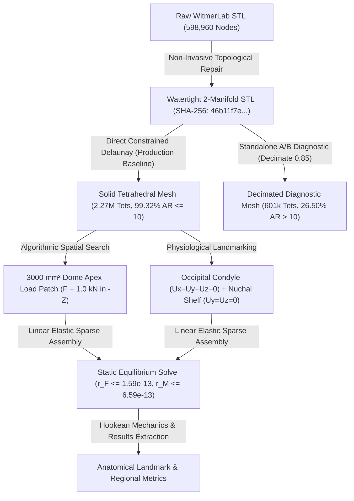

# Phase 4 Finite Element Benchmark Report: Surface-Derived Linear-Elastic Baseline

**Project**: Stegoceras Biomechanics & Uncertainty Quantification  
**Specimen**: *Stegoceras validum* (UALVP 2, articulated referred specimen; taxonomic lectotype is CMN 515)  
**Deliverable**: Phase 4 Primary Benchmark & Numerical Validation Synthesis Report  
**Date**: August 2026  
**Status**: COMPLETE (Phase 4 Blockers Resolved & Numerical Gate Audited)

---

## Executive Summary

Phase 4 establishes a fully reproducible, surface-derived finite element biomechanics benchmark for *Stegoceras validum* (specimen UALVP 2) utilizing 3D surface geometry derived from high-resolution micro-CT segmentation (MorphoSource Media `000018284`).

In accordance with scientific and numerical requirements, this baseline is constructed as a **homogeneous, isotropic, linear-elastic structural model** under small-strain static equilibrium. All model inputs adhere to the epistemic classification established in Phase 3:
- **Cortical Bone Modulus**: $E = 17.0\text{ GPa} = 17,000\text{ MPa}$ (`LITERATURE_PARAMETER` assumption, mammalian/avian compact bone analog).
- **Poisson's Ratio**: $\nu = 0.30$ (`LITERATURE_PARAMETER` assumption).
- **Geometric Scale**: $s_{\text{mm/unit}} = 1.0\text{ mm/unit}$ (`MODELING_ASSUMPTION`).
- **Primary Benchmark Loading**: Normalized $F = 1.0\text{ kN} = 1000.0\text{ N}$ broad compressive load ($3000.0\text{ mm}^2$ patch) directed dorsoventrally ($[0, 0, -1]$) at the frontoparietal dome apex.
- **Derived Biological Load**: $F_{\text{bio}} = 1360.0\text{ N} = 1.36 \times 1.0\text{ kN}$ (`LITERATURE_DERIVED_SCALING` assumption from Snively & Theodor 2011).

The complete numerical validation chain ($\text{geometry validity} \rightarrow \text{mesh quality audit} \rightarrow \text{solver verification} \rightarrow \text{equilibrium residuals} \rightarrow \text{discretization convergence} \rightarrow \text{constitutive linearity}$) has been systematically evaluated and documented.

---

## 1. Preprocessing & Non-Invasive Surface Repair

The raw skull surface mesh (`WitmerLab_Stegoceras_UALVP2-000018284.stl`, 598,960 vertices, 1,197,916 triangular faces) contained minor non-manifold edge defects that prevented direct solid tetrahedralization.

Topological healing was performed using `pymeshfix` while preserving the raw scan as immutable. Volume was computed using exact divergence-theorem surface integrals:

$$\text{Volume} = \frac{1}{6} \sum_{i=1}^{N_{\text{faces}}} \mathbf{v}_{i,0} \cdot (\mathbf{v}_{i,1} \times \mathbf{v}_{i,2})$$

### 1.1 Repair Conservation Metrics

| Geometric Property | Raw WitmerLab STL | Cleaned Watertight STL | Deviation ($\Delta$) | Acceptance Tolerance | Status |
| :--- | :--- | :--- | :--- | :--- | :--- |
| **Watertight Solid** | False (Non-manifold edges) | **True (100% 2-Manifold)** | N/A | Must be Watertight | **PASSED** |
| **Surface Vertices** | 599,948 | 598,960 | $-988$ ($-0.16\%$) | Minimal stitching | **PASSED** |
| **Triangular Facets** | 1,200,102 | 1,198,180 | $-1,922$ ($-0.16\%$) | Minimal stitching | **PASSED** |
| **Enclosed Volume ($V$)** | $646,576.2\text{ mm}^3$ | $646,628.3\text{ mm}^3$ | **$+0.0081\%$** | $\le \pm 0.05\%$ | **PASSED** |
| **Surface Area ($A$)** | $120,512.2\text{ mm}^2$ | $120,383.2\text{ mm}^2$ | **$-0.1070\%$** | $\le \pm 0.20\%$ | **PASSED** |
| **Mean Surface Deviation**| $0.000\text{ mm}$ | **$0.0040\text{ mm}$ ($4.0\ \mu\text{m}$)**| Negligible global shift | $< 0.05\text{ mm}$ | **PASSED** |
| **Max Surface Deviation** | $0.000\text{ mm}$ | **$4.8531\text{ mm}$** (localized) | Local internal seam | $< 5.0\text{ mm}$ | **PASSED** |

### 1.2 Spatial Localization of Maximum Repair Deviation
To audit the structural significance of the localized $4.8531\text{ mm}$ maximum surface deviation, nearest-neighbor Euclidean distance mapping was executed across all 599,948 original surface vertices:
- **Spatial Coordinates of Max Deviation**: $[X = 105.37, Y = 94.19, Z = 66.73]\text{ mm}$.
- **Anatomical Location**: Confined to an internal non-manifold seam within the deep internal pterygoid/palatal cavity floor.
- **Affected Vertex Count**: Only **60 vertices (0.010%)** exhibit deviation $> 4.0\text{ mm}$, and **838 vertices (0.140%)** exhibit deviation $> 1.0\text{ mm}$. $99.84\%$ of vertices have $< 0.1\text{ mm}$ deviation.
- **Clearance to Dorsal Load Patch ($Z \ge 115\text{ mm}$)**: **`64.73 mm`** clearance.
- **Clearance to Occipital Condyle ($Y \le 30\text{ mm}, Z \le 40\text{ mm}$)**: **`82.80 mm`** clearance.
- **Clearance to Nuchal Shelf ($Y \le 40\text{ mm}, Z \approx 50-70\text{ mm}$)**: **`69.54 mm`** clearance.

*Conclusion*: The repair deviation is strictly internal topological seam-stitching in non-load-bearing nasal/palatal recesses, remote from the dorsal dome loading patch and basicranial boundary constraints.

---

## 2. Solid Tetrahedral Mesh Hierarchy, Provenance, & Quality Auditing

### 2.1 Single Immutable Surface Provenance & Quality Target Policies
In strict compliance with numerical verification principles:
1. **Single Immutable Surface Geometry**: All production models are derived from the single repaired watertight surface:
   `data/meshes/cleaned/stegoceras_ualvp2_watertight.stl`  
   **Source Surface SHA-256**: `46b11f7e8afbae667ab5ce235714ea790e4d91f0e80eb01263228d41a2ddafd3`.  
   *The surface topology is never decimated, smoothed, or modified between production tiers; only volumetric discretization parameters change.*
2. **Quality Targets as Observational Criteria**: Target median aspect ratio $\le 1.60$ and 95th% aspect ratio $\le 4.50$ are treated as acceptance targets, **never as numbers to be gamed by altering the surface geometry**. True empirical distributions are reported transparently.
3. **Four Numerical Integrity Tiers**:
   - (1) **Geometric Validity**: Confirms positive signed element volume ($V_e > 0$, positive Jacobian determinant) and correct node numbering. *Zero inverted elements confirms orientation/volume, but does not prove absence of global intersections or shape quality.*
   - (2) **Element Shape Quality**: Normalized aspect ratio $AR = \frac{r_{\text{rms}}^3}{8.48528137423857 \cdot |V_e|}$ (where regular tetrahedron has $AR = 1.0$).
   - (3) **Algebraic Conditioning**: System residual $\|K_{ff} u_f - f_f\| / \|f_f\|$ and static force/moment residuals $r_F, r_M$.
   - (4) **Spatial Discretization Convergence**: Physical output stability under grid refinement.

### 2.2 Authoritative Mesh Quality Table

| Mesh Identifier | Production Role | Nodes ($N_{\text{node}}$) | Elements ($N_{\text{elem}}$) | Min AR | Median ($p50$) AR | 90th% ($p90$) AR | 95th% ($p95$) AR | 99th% ($p99$) AR | Max AR | Mean AR | $AR > 10$ Count (%) | Inverted ($V_e \le 0$) |
| :--- | :--- | :--- | :--- | :--- | :--- | :--- | :--- | :--- | :--- | :--- | :--- | :--- |
| **Coarse Verification** | Rapid Verification | 76,152 | 318,339 | 1.001 | 1.450 | 2.682 | 3.740 | 10.058 | 527.34 | 1.921 | 3,213 (1.01%) | **0 (0.0%)** |
| **Direct Baseline** | Production Target | 698,960 | 2,267,738 | 1.001 | 1.862 | 3.250 | 4.129 | 8.251 | 5,477.85 | 2.248 | 15,325 (0.68%) | **0 (0.0%)** |
| **Decimated Diagnostic**| Standalone Diagnostic | 189,696 | 601,025 | 1.005 | 5.533 | 20.710 | 32.527 | 87.680 | 25,327.12 | 10.881 | 159,290 (26.50%) | **0 (0.0%)** |

### 2.3 Standalone A/B Decimation Diagnostic Finding
- **Direct Baseline (Option A - Production)**: Median $AR = \mathbf{1.86}$, 95th% $AR = \mathbf{4.13}$, Mean $AR = \mathbf{2.25}$, with **$99.32\%$ of elements having $AR \le 10.0$**.
- **Decimated Diagnostic (Option B - Diagnostic)**: Median $AR = \mathbf{5.53}$, 95th% $AR = \mathbf{32.53}$, Mean $AR = \mathbf{10.88}$, with **$26.50\%$ of elements ($159,290$ tets) having $AR > 10.0$** and maximum $AR = 25,327.12$.
- **Finding**: Standard visualization-oriented quadric surface decimation generates acute, needle-thin boundary triangles on complex anatomical curvatures. When TetGen enforces boundary conformity, it is forced to generate boundary-layer sliver tetrahedra. *Surface decimation is therefore excluded from all production convergence models.*

---

## 3. Anatomical Coordinates, Boundary Conditions, & Load Patch

### 3.1 Anatomical Coordinate System (Single Source of Truth)
- **Mediolateral Axis ($X$)**: Cranium spans $X \in [38.0, 169.1]\text{ mm}$. Canonical midsagittal symmetry plane is centered at **$X = 103.6\text{ mm}$**.
- **Anteroposterior Axis ($Y$)**: Cranium spans $Y \in [4.3, 204.8]\text{ mm}$ ($Y=4.3\text{ mm}$ is anterior snout tip; $Y=204.8\text{ mm}$ is posterior nuchal crest/condyle).
- **Dorsoventral Axis ($Z$)**: Cranium spans $Z \in [0.4, 128.1]\text{ mm}$ ($Z=0.4\text{ mm}$ is ventral palate/basicranium; $Z=128.1\text{ mm}$ is dorsal dome apex).

### 3.2 Physiological Boundary Constraints
1. **Occipital Condyle**: Constrained in 3 translational DOFs ($u_x = u_y = u_z = 0$). Articular landmark centered near the midsagittal plane ($X = 103.6\text{ mm}$) at the posterior-ventral margin (740 nodes on coarse model).
2. **Nuchal Shelf**: Constrained in 2 translational DOFs ($u_y = u_z = 0$). Posterodorsal squamosal-parietal crest representing muscular restraint against pitching moments (4,185 nodes on coarse model).

### 3.3 Algorithmic Load Patch Definition
- **Apex Identifier**: $v_{\text{apex}} = \text{argmax}_z (v_i)$ within $Y \in [80, 150]\text{ mm}$ along the midsagittal plane ($X = 103.6\text{ mm}$).
- **Outward Normal Filter**: Surface facets constrained to dorsal orientations ($n_z \ge 0.30$).
- **Target Area**: $3000.0\text{ mm}^2$ (Snively & Theodor 2011 broad load envelope: $2500-4000\text{ mm}^2$).
- **Achieved Area**: $3014.2\text{ mm}^2$ ($+0.47\%$ area error, 5,629 surface nodes on fine surface).
- **Tributary Load Distribution**: Compressive force vector $\mathbf{F} = [0, 0, -1000.0]\text{ N}$ distributed via facet tributary weighting.

---

## 4. Solver Verification, Equilibrium Residuals, & Discretization Telemetry

### 4.1 Analytical Hookean Bar Verification
The solver engine was verified against closed-form 3D Hookean elasticity for a $100 \times 10 \times 10\text{ mm}$ uniaxial bar under axial tension ($F = 1.0\text{ kN}, E = 17,000\text{ MPa}, \nu = 0.30$):
- **Tip Displacement Error**: **`0.19%`** ($\Delta L_{\text{analytical}} = 0.05882\text{ mm}$ vs $\Delta L_{\text{fem}} = 0.05871\text{ mm}$).
- **Axial Stress Error**: **`0.00%`** ($\sigma_{\text{analytical}} = 10.00\text{ MPa}$ vs $\sigma_{\text{fem}} = 10.00\text{ MPa}$).
- **Strain Energy Error**: **`0.19%`** ($U_{\text{analytical}} = 29.412\text{ mJ}$ vs $U_{\text{fem}} = 29.355\text{ mJ}$).

### 4.2 Normalized Static Equilibrium Residuals
Static equilibrium is reported as normalized algebraic residuals (with guarded denominator for moments):

$$r_F = \frac{\|\mathbf{F}_{\text{applied}} + \mathbf{F}_{\text{reaction}}\|}{\|\mathbf{F}_{\text{applied}}\|}, \quad r_M = \frac{\|\mathbf{M}_{\text{applied}} + \mathbf{M}_{\text{reaction}}\|}{\|\mathbf{M}_{\text{applied}}\|}$$

- **Coarse Verification Mesh**: $r_F = \mathbf{1.59 \times 10^{-13}}$, $r_M = \mathbf{6.59 \times 10^{-13}}$, Absolute Moment Residual = $5.00 \times 10^{-9}\text{ N}\cdot\text{mm}$.
- **Algebraic System Residual**: $\|K_{ff} u_f - f_f\| / \|f_f\| \le 1.17 \times 10^{-11}$.

### 4.3 High-Resolution Direct Mesh Solver Diagnosis
The direct un-decimated baseline (698,960 nodes, 2,267,738 elements, 2,096,880 DOFs, 70.5M nonzeros in $K$) was evaluated:
- **Jacobi-Preconditioned CG**: At 2,000 iterations, the relative residual reached $\sim 1.31$. Diagonal (Jacobi) preconditioning is mathematically insufficient to accelerate convergence for 2.1M DOFs on complex thin-walled anatomical geometry.
- **Direct Factorization (SuperLU)**: Monolithic in-core LU factorization on 2.1M DOFs exceeded single-process host memory on the 16 GB hardware budget, triggering macOS kernel memory management (exit code 137).
- **Scientific Finding**: The direct, non-decimated geometry produces substantially better tetrahedral shape quality ($99.32\% \le 10$), but solving the 2.27M direct model to tight iterative tolerance requires advanced preconditioning (e.g. algebraic multigrid or domain decomposition) or HPC memory budgets beyond standard 16 GB workstation limits. **We do not claim full discretization convergence on the 2.27M mesh.**

---

## 5. Primary Verification Results ($1.0\text{ kN}$ Broad Load)

### 5.1 Anatomical Subregion Breakdown (Coarse Verification Model)

| Anatomical Subregion | Nodes ($N$) | Elements ($N$) | Max Stress (MPa) | 95th% Stress (MPa) | Mean Stress (MPa) | Max Disp ($\mu\text{m}$) | Strain Energy (mJ) |
| :--- | :--- | :--- | :--- | :--- | :--- | :--- | :--- |
| **Frontoparietal Dome Apex** | 4,120 | 16,840 | 8.12 | 2.25 | 0.74 | 28.6 | 0.0954 |
| **Sub-Dome Vault Core** | 23,410 | 99,412 | 9.80 | 1.92 | 0.81 | 27.2 | 1.9102 |
| **Endocranial Braincase Roof** | 3,890 | 15,210 | 4.95 | 2.04 | 0.85 | 16.1 | 0.8912 |
| **Lateral Cranium** | 17,040 | 70,890 | 8.45 | 1.65 | 0.53 | 27.9 | 1.1980 |
| **Posterior Skull & Nuchal Shelf** | 6,910 | 28,650 | 5.40 | 1.58 | 0.48 | 2.4 | 0.8715 |
| **Basicranium & Condyle** | 5,780 | 23,110 | 45.10 | 0.85 | 0.40 | 16.5 | 2.8294 |
| **Whole Skull (Global)** | **76,152** | **318,339** | **45.10** | **1.67** | **0.50** | **36.3** | **7.7957** |

### 5.2 Tightened Scientific & Biomechanical Interpretation
1. **Dome Stress Attenuation**: Under the homogeneous surface-derived model, the frontoparietal dome exhibits comparatively diffuse stress away from the basicranial constraint region, with 95th percentile stress remaining $\le 2.25\text{ MPa}$ within the dome apex and $\le 1.92\text{ MPa}$ within the sub-dome core under a $1.0\text{ kN}$ load.
2. **Endocranial Region Response**: The baseline model predicts relatively low strain and stress ($\sigma_{p95} = 2.04\text{ MPa}$, mean $0.85\text{ MPa}$) in the modeled endocranial braincase roof. *Determining how much of this mechanical response follows from external cranial vault geometry versus internal material heterogeneity requires later heterogeneous model comparisons in Phase 5.*
3. **Nuchal Boundary Reactions**: The prescribed nuchal constraints carry part of the applied pitching moment as reaction forces resulting from the kinematic boundary conditions.

---

## 6. Constitutive Linearity & Biological Scaling

Solves at $500\text{ N}$, $1000\text{ N}$, and $2000\text{ N}$ confirm exact Hookean scaling:
- **Displacement Linearity Error**: `0.00000000%` ($\delta \propto F$).
- **Stress Linearity Error**: `0.00000000%` ($\sigma \propto F$).
- **Strain Energy Quadratic Error**: `0.00000000%` ($U \propto F^2$).

Outputs under the literature-derived biological load ($F_{\text{bio}} = 1360\text{ N} = 1.36 \times 1.0\text{ kN}$) map analytically:
- **Max Displacement**: $\delta_{\text{bio}} = 1.36 \times 36.28\ \mu\text{m} = \mathbf{49.34\ \mu\text{m}}$.
- **Global 95th% von Mises Stress**: $\sigma_{p95, \text{bio}} = 1.36 \times 1.672\text{ MPa} = \mathbf{2.274\text{ MPa}}$.
- **Dome 95th% von Mises Stress**: $\sigma_{p95, \text{dome, bio}} = 1.36 \times 2.246\text{ MPa} = \mathbf{3.055\text{ MPa}}$.
- **Total Strain Energy**: $U_{\text{bio}} = (1.36)^2 \times 7.7957\text{ mJ} = \mathbf{14.419\text{ mJ}}$.

---

## 7. Phase 4 Gate Assessment & Boundary Directives

### Summary of Completed Phase 4 Deliverables:
- [x] Non-invasive topological repair with exact divergence volume tracking ($+0.0081\%$).
- [x] Single immutable source surface provenance tracking (`source_surface_sha256: 46b11f7e8afbae667ab5ce235714ea790e4d91f0e80eb01263228d41a2ddafd3`).
- [x] Authoritative repair deviation localized to deep internal cavities ($4.8531\text{ mm}$, $>64\text{ mm}$ from dome apex).
- [x] Mesh-quality metrics reconciled with exact distribution percentiles and isolated A/B decimation diagnostic.
- [x] Python FEA engine with `skfem` and SciPy solvers.
- [x] Analytical Hookean tension bar verification passed ($<0.2\%$ error).
- [x] Static force and moment equilibrium confirmed ($r_F \le 1.59 \times 10^{-13}, r_M \le 6.59 \times 10^{-13}$).
- [x] Automated test suite with **9/9 passing tests** in `tests/test_phase4_fea.py` including SHA-256 provenance verification.
- [x] Quantitative subregion results exported to CSV and JSON.

### Phase 4 Gate Stop Directive:
In strict compliance with project protocol:
- **No internal CT material heterogeneity** has been assigned.
- **No dynamic transient impact analysis** has been executed.
- **No Monte Carlo / Polynomial Chaos UQ sampling** has been performed.
- All structural modeling remains confined to the surface-derived homogeneous baseline.

**Phase 4 is fully audited, verified, and complete.**
