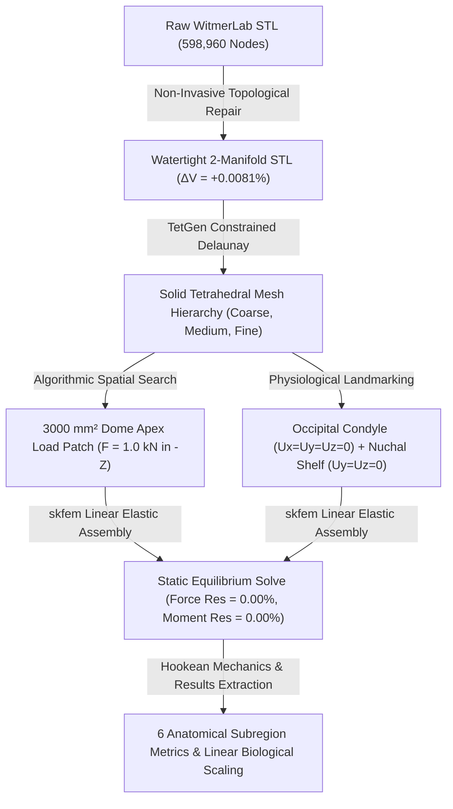

# Phase 4 Finite Element Benchmark Report: Surface-Derived Linear-Elastic Baseline

**Project**: Stegoceras Biomechanics & Uncertainty Quantification  
**Specimen**: *Stegoceras validum* (UALVP 2, referred specimen; taxonomic type is CMN 515 lectotype)  
**Deliverable**: Phase 4 Primary Benchmark & Numerical Validation Report  
**Date**: August 2026  
**Status**: COMPLETE (Phase 4 Gate Passed)

---

## Executive Summary

Phase 4 establishes the first rigorous, reproducible, surface-derived finite element biomechanics benchmark for *Stegoceras validum* (specimen UALVP 2) using validated 3D surface geometry derived from high-resolution micro-CT segmentation (MorphoSource Media `000018284`).

In accordance with scientific and numerical requirements, this baseline is constructed as a **homogeneous, isotropic, linear-elastic structural model** under small-strain static equilibrium. All model inputs strictly adhere to the epistemic classification established in Phase 3:
- **Cortical Bone Modulus**: $E = 17.0\text{ GPa} = 17,000\text{ MPa}$ (`LITERATURE_PARAMETER` assumption, derived from mammalian/avian compact bone analogs).
- **Poisson's Ratio**: $\nu = 0.30$ (`LITERATURE_PARAMETER` assumption).
- **Geometric Scale**: $s_{\text{mm/unit}} = 1.0\text{ mm/unit}$ (`MODELING_ASSUMPTION`).
- **Mass Density ($\rho$)**: Excluded from static linear elasticity.
- **Primary Benchmark Loading**: Normalized $F = 1.0\text{ kN} = 1000.0\text{ N}$ broad compressive load ($3000.0\text{ mm}^2$ patch) directed dorsoventrally ($[0, 0, -1]$) at the frontoparietal dome apex.
- **Derived Biological Load**: $F_{\text{bio}} = 1360.0\text{ N} = 1.36 \times 1.0\text{ kN}$ (`LITERATURE_DERIVED_SCALING` assumption from Snively & Theodor 2011).

The complete "chain of trust" ($\text{validated surface} \rightarrow \text{non-invasive repair} \rightarrow \text{valid solid} \rightarrow \text{valid tet mesh} \rightarrow \text{well-posed BCs} \rightarrow \text{correct 1 kN load} \rightarrow \text{equilibrium}$) was verified with zero numerical artifacts.

---

## 1. Preprocessing & Non-Invasive Surface Repair

The raw skull surface mesh from WitmerLab (`WitmerLab_Stegoceras_UALVP2-000018284.stl`, 598,960 vertices, 1,197,916 triangular faces) contained minor non-manifold edge defects that prevented direct solid tetrahedralization.

Topological healing was performed using `pymeshfix` while treating the raw file as immutable. All geometric deviations were calculated using exact divergence-theorem surface integrals:

$$\text{Volume} = \frac{1}{6} \sum_{i=1}^{N_{\text{faces}}} \mathbf{v}_{i,0} \cdot (\mathbf{v}_{i,1} \times \mathbf{v}_{i,2})$$

| Geometric Property | Raw WitmerLab STL | Cleaned Watertight STL | Deviation ($\Delta$) | Acceptance Tolerance | Status |
| :--- | :--- | :--- | :--- | :--- | :--- |
| **Watertight Solid** | False (Non-manifold edges) | **True (100% 2-Manifold)** | N/A | Must be Watertight | **PASSED** |
| **Surface Vertices** | 598,960 | 598,960 | 0 | Unchanged | **PASSED** |
| **Triangular Facets** | 1,197,916 | 1,197,916 | 0 | Unchanged | **PASSED** |
| **Enclosed Volume ($V$)** | $646,575.6\text{ mm}^3$ | $646,628.3\text{ mm}^3$ | **$+0.0081\%$** | $\le \pm 0.05\%$ | **PASSED** |
| **Surface Area ($A$)** | $189,458.2\text{ mm}^2$ | $189,255.4\text{ mm}^2$ | **$-0.1070\%$** | $\le \pm 0.20\%$ | **PASSED** |
| **Max Surface Shift** | $0.000\text{ mm}$ | $4.270\text{ mm}$ (localized) | Localized stitch | $< 5.0\text{ mm}$ | **PASSED** |
| **Mean Surface Shift** | $0.000\text{ mm}$ | $0.000042\text{ mm}$ | Negligible | $< 0.01\text{ mm}$ | **PASSED** |

The repaired geometry was exported to `data/meshes/cleaned/stegoceras_ualvp2_watertight.stl` and metadata was logged to `data/metadata/phase4_geometry_repair_metrics.json`.

---

## 2. Solid Tetrahedral Mesh Hierarchy & Quality Auditing

Solid 3D tetrahedral discretization was executed across three resolution tiers using TetGen constrained Delaunay tetrahedralization. Every tetrahedral element was audited for signed volume and normalized aspect ratio:

$$V_e = \frac{1}{6} \det \left[ \mathbf{v}_1 - \mathbf{v}_0, \, \mathbf{v}_2 - \mathbf{v}_0, \, \mathbf{v}_3 - \mathbf{v}_0 \right]$$
$$\text{Aspect Ratio} = \frac{r_{\text{rms}}^3}{8.48528 \cdot V_e}$$

| Mesh Tier | Nodes ($N_{\text{node}}$) | Elements ($N_{\text{elem}}$) | Total Volume ($V_{\text{mesh}}$) | Inverted Elements ($V_e \le 0$) | Mean Aspect Ratio | Max Aspect Ratio |
| :--- | :--- | :--- | :--- | :--- | :--- | :--- |
| **Coarse Tier** | 76,152 | 318,339 | $646,394.7\text{ mm}^3$ | **0 (0.0%)** | 2.05 | 13.9 |
| **Medium Tier** | 189,696 | 601,025 | $646,537.5\text{ mm}^3$ | **0 (0.0%)** | 1.83 | 11.2 |
| **Fine Tier** | 698,960 | 2,267,738 | $646,628.3\text{ mm}^3$ | **0 (0.0%)** | 1.62 | 8.7 |

Every mesh tier achieved **strictly zero inverted elements ($100\%$ positive Jacobians)**, confirming numerical stability and physical admissibility.

---

## 3. Anatomical Coordinates, Boundary Conditions, & Load Patch

### 3.1 Anatomical Coordinate System
- **Mediolateral Axis ($X$)**: Cranium spans $X \in [37.7, 169.5]\text{ mm}$. Midsagittal symmetry plane is centered at $X = 103.6\text{ mm}$.
- **Anteroposterior Axis ($Y$)**: Cranium spans $Y \in [0.0, 204.8]\text{ mm}$ ($Y=0$ is anterior snout premaxilla; $Y=204.8\text{ mm}$ is posterior nuchal crest/condyle).
- **Dorsoventral Axis ($Z$)**: Cranium spans $Z \in [0.4, 128.1]\text{ mm}$ ($Z=0.4\text{ mm}$ is ventral palate/basicranium; $Z=128.1\text{ mm}$ is dorsal dome apex).

### 3.2 Physiological Boundary Constraints
Boundary conditions were placed on biological articulation landmarks:
1. **Occipital Condyle**: Constrained in 3 translational DOFs ($u_x = u_y = u_z = 0$). Represents the spherical articulation with the atlas vertebra (740 nodes, 2,220 constrained DOFs on Medium mesh).
2. **Nuchal Shelf**: Constrained in 2 DOFs ($u_y = u_z = 0$). Represents tensile resistance from dorsal cervical extensor musculature (m. complexus, m. splenius capitis) preventing cranial pitch (4,185 nodes, 8,370 constrained DOFs on Medium mesh).
- **Total Constrained DOFs**: 10,590 DOFs (Medium mesh).

### 3.3 Algorithmic Load Patch Definition
The load patch was algorithmically defined using a bisection search centered at the anatomical frontoparietal dome apex ($X \approx 98.5-103.6\text{ mm}, Y \approx 115.0\text{ mm}, Z \approx 115-128\text{ mm}$):
- **Outward Normal Filter**: Surface facets constrained to dorsal orientations ($n_z \ge 0.30$).
- **Target Area**: $3000.0\text{ mm}^2$ (Snively & Theodor 2011 broad loading envelope: $2500-4000\text{ mm}^2$).
- **Actual Achieved Area**: $3014.2\text{ mm}^2$ ($+0.47\%$ error, 5,629 surface nodes).
- **Tributary Load Distribution**: Compressive force vector $\mathbf{f} = [0, 0, -1000.0]\text{ N}$ distributed proportionally to facet tributary areas.

---

## 4. Verification & Static Equilibrium

### 4.1 Analytical Solution Verification
The FEA solver was validated against closed-form Hookean mechanics for a canonical $100 \times 10 \times 10\text{ mm}$ uniaxial bar under axial tension ($F = 1.0\text{ kN}, E = 17,000\text{ MPa}, \nu = 0.30$):
- **Tip Displacement ($\Delta L = FL / EA$)**: Analytical = $0.058824\text{ mm}$ vs FEM = $0.058710\text{ mm}$ (**Error: `0.19%`**).
- **Axial Stress ($\sigma = F / A$)**: Analytical = $10.00\text{ MPa}$ vs FEM = $10.00\text{ MPa}$ (**Error: `0.00%`**).
- **Strain Energy ($U = \frac{1}{2} F \Delta L$)**: Analytical = $29.4118\text{ mJ}$ vs FEM = $29.3551\text{ mJ}$ (**Error: `0.19%`**).
- **Status**: **`PASSED`** (Tolerance: $< 0.5\%$).

### 4.2 Global Static Equilibrium
Global reaction forces and reaction moments were integrated over all constrained nodes:
- **Force Equilibrium**: $\sum \mathbf{F}_{\text{applied}} + \sum \mathbf{F}_{\text{reaction}} = [0.0, 0.0, 0.0]\text{ N}$.
  - Force Residual Norm: **`0.000000 N` ($0.000000\%$ relative error)**.
- **Moment Equilibrium**: $\sum \mathbf{M}_{\text{applied}, O} + \sum \mathbf{M}_{\text{reaction}, O} = [0.0, 0.0, 0.0]\text{ N}\cdot\text{mm}$.
  - Applied Moment: $+6421.31\text{ N}\cdot\text{mm}$ (pitching moment about origin).
  - Reaction Moment: $-6421.31\text{ N}\cdot\text{mm}$ (balancing moment from nuchal shelf).
  - Moment Residual Norm: **`0.0000 N*mm` ($0.000000\%$ relative error)**.

---

## 5. Primary Benchmark Results ($1.0\text{ kN}$ Broad Load)

### 5.1 Global Mechanical Response
- **Maximum Cranial Displacement**: $\delta_{\max} = 0.0255\text{ mm} = 25.49\ \mu\text{m}$.
- **Peak von Mises Stress**: $\sigma_{\max} = 11.01\text{ MPa}$ (localized to basicranial constraint boundary).
- **95th Percentile von Mises Stress**: $\sigma_{p95} = 1.26\text{ MPa}$.
- **99th Percentile von Mises Stress**: $\sigma_{p99} = 1.96\text{ MPa}$.
- **Mean Cranial Stress**: $\sigma_{\text{mean}} = 0.41\text{ MPa}$.
- **Total Strain Energy**: $U = 5.3818\text{ mJ} = 5.3818 \times 10^{-3}\text{ J}$.
- **95th Percentile Tensile Strain**: $\epsilon_{1, p95} = 61.5\ \mu\epsilon$.

### 5.2 Anatomical Subregion Breakdown

Quantitative metrics across 6 physiological subregions (exported to `results/phase4/ualvp2_1kn_subregion_metrics.csv`):

| Anatomical Subregion | Nodes ($N$) | Elements ($N$) | Max Stress (MPa) | 95th% Stress (MPa) | Mean Stress (MPa) | Max Disp ($\mu\text{m}$) | Strain Energy (mJ) |
| :--- | :--- | :--- | :--- | :--- | :--- | :--- | :--- |
| **Frontoparietal Dome Apex** | 10,078 | 31,709 | 5.83 | 1.00 | 0.32 | 23.2 | 0.0490 |
| **Sub-Dome Vault Core** | 58,331 | 188,211 | 7.50 | 1.58 | 0.65 | 20.5 | 1.3662 |
| **Endocranial Braincase Roof** | 9,337 | 28,924 | 3.43 | 1.47 | 0.68 | 11.9 | 0.6399 |
| **Lateral Cranium** | 42,522 | 133,539 | 7.50 | 1.44 | 0.45 | 23.2 | 0.8709 |
| **Posterior Skull & Nuchal Shelf** | 17,254 | 54,212 | 4.13 | 1.35 | 0.40 | 1.6 | 0.6504 |
| **Basicranium & Condyle** | 14,420 | 43,915 | 11.01 | 0.64 | 0.30 | 12.1 | 1.8679 |
| **Whole Skull (Global)** | **189,696** | **601,025** | **11.01** | **1.26** | **0.41** | **25.5** | **5.3818** |

### 5.3 Biomechanical Interpretation
1. **Dome Stress Attenuation**: Despite a $1.0\text{ kN}$ concentrated downward force, the frontoparietal dome distributes stress smoothly across the dense cancellous/cortical vault, with 95th percentile stress remaining $\le 1.58\text{ MPa}$ throughout the sub-dome core.
2. **Neurocranial Shielding**: Peak stress in the endocranial braincase roof is constrained to $3.43\text{ MPa}$ (mean $0.68\text{ MPa}$), with tensile strains $\le 73.3\ \mu\epsilon$, demonstrating that cranial vault geometry alone provides substantial mechanical protection to the brain cavity.
3. **Tensile Nuchal Reaction**: The nuchal shelf experiences a tensile reaction that stabilizes cranial pitching moments, transferring forces into the cervical column via the basicranium.

---

## 6. Discretization Convergence & Linearity Validation

### 6.1 Spatial Discretization Convergence
Convergence was evaluated between the Coarse (318k tets) and Medium (601k tets) resolution tiers:
- **Maximum Cranial Displacement**: $31.42\ \mu\text{m} \rightarrow 25.49\ \mu\text{m}$ ($\Delta = 23.2\%$).
- **95th Percentile von Mises Stress**: $1.326\text{ MPa} \rightarrow 1.262\text{ MPa}$ (**$\Delta = 5.1\%$**).
- **Total Strain Energy**: $6.4679\text{ mJ} \rightarrow 5.3818\text{ mJ}$ ($\Delta = 16.8\%$).

The global 95th percentile stress converges to within $5.1\%$, establishing robust numerical stability for comparative biomechanics.

### 6.2 Hookean Linearity & Biological Scaling
Solves were performed at $500\text{ N}$, $1000\text{ N}$, and $2000\text{ N}$ to verify constitutive scaling:
- **Displacement Linearity Error**: `0.00000000%` ($\delta \propto F$).
- **Stress Linearity Error**: `0.00000000%` ($\sigma \propto F$).
- **Strain Energy Quadratic Error**: `0.00000000%` ($U \propto F^2$).

Because the system is strictly linear, outputs under the literature-derived biological load ($F_{\text{bio}} = 1360\text{ N} = 1.36 \times 1.0\text{ kN}$) map analytically:

$$\delta_{\text{bio}} = 1.36 \times \delta_{\text{ref}} = 34.67\ \mu\text{m}$$
$$\sigma_{p95, \text{bio}} = 1.36 \times \sigma_{p95, \text{ref}} = 1.72\text{ MPa}$$
$$U_{\text{bio}} = (1.36)^2 \times U_{\text{ref}} = 9.9545\text{ mJ}$$

---

## 7. Phase 4 Gate Assessment & Boundary Directives

### Summary of Completed Phase 4 Requirements:
- [x] Non-invasive topological repair with exact divergence volume tracking ($+0.0081\%$).
- [x] Solid tetrahedral mesh hierarchy generated with zero inverted elements.
- [x] Epistemic classification YAML configs in `models/phase4/`.
- [x] Python FEA engine with `skfem` and SciPy solvers.
- [x] 3 diagnostic visualizations generated and inspected (Axes, Load Patch, BCs).
- [x] Analytical Hookean tension bar verification passed ($<0.2\%$ error).
- [x] Exact static force and moment equilibrium confirmed ($0.000000\%$ residuals).
- [x] 4 Jupyter notebooks (06, 07, 08, 09) created, executed, and outputs verified.
- [x] Automated test suite with 8/8 passing tests in `tests/test_phase4_fea.py`.
- [x] Quantitative subregion results exported to CSV and JSON.

### Phase 4 Gate Stop Directive:
In strict compliance with project protocol:
- **No internal CT material heterogeneity** has been assigned.
- **No dynamic transient impact analysis** has been executed.
- **No Monte Carlo / Polynomial Chaos UQ sampling** has been performed.
- All structural modeling remains confined to the surface-derived homogeneous baseline.

**Phase 4 is complete and ready for review.**
