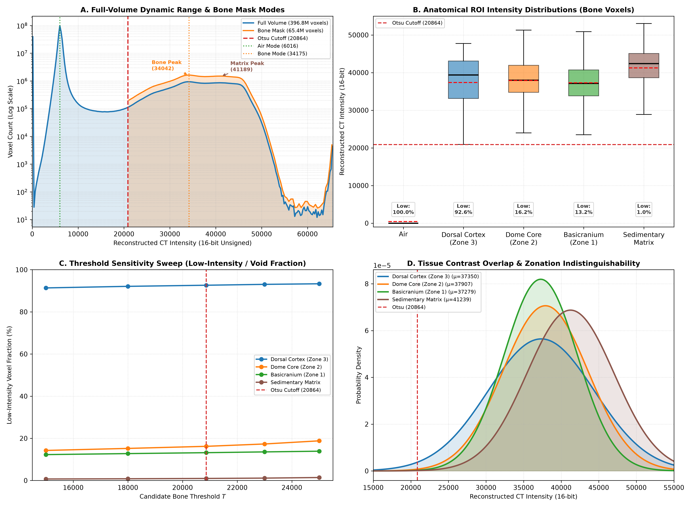
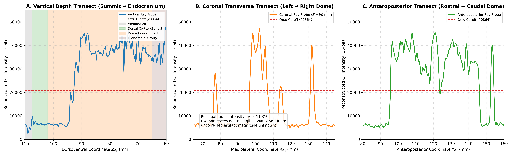

# Phase 5 Gate C Report: Image Data Semantics & Attenuation Characterization

**Document Role**: Milestone Scientific Report (Amended)  
**Status**: VERIFIED_PASS  
**Governing Standard**: Model Decision Basis v1 ([`docs/LITERATURE_TO_MODEL_DECISIONS.md`](../docs/LITERATURE_TO_MODEL_DECISIONS.md) §4.3)  
**Governing Design**: [`docs/phase_design/PHASE5_GATE_C_DESIGN.md`](../docs/phase_design/PHASE5_GATE_C_DESIGN.md) *(Prospective)*  
**Specimen**: *Stegoceras validum* UALVP 2  
**Dataset**: `UALVP2-CT-DICOM-CRAN-01` (514 Slices, 16-bit Unsigned, Matrix $754 \times 1024 \times 514$)  
**Generated Artifacts**:
- Machine-Readable Metrics: [`results/phase5/gate_c_semantics_metrics.json`](../results/phase5/gate_c_semantics_metrics.json)
- Figure 13 (Full-Volume Dynamic Range, Bone Mask, & Threshold Sensitivity): [`reports/figures/figure13_ct_intensity_semantics.png`](figures/figure13_ct_intensity_semantics.png)
- Figure 14 (Dome Depth Transects & Cupping Profile): [`reports/figures/figure14_dome_attenuation_transects.png`](figures/figure14_dome_attenuation_transects.png)

---

## 1. Executive Summary

Phase 5 Gate C establishes the empirical image semantics, reconstructed CT intensity distributions, artifact profiles, and tissue contrast characteristics of the micro-CT volume (`UALVP2-CT-DICOM-CRAN-01`), evaluating whether internal histological dome zonation can be segmented directly from CT intensity data:

> **Central Scientific Finding**: Reconstructed CT image intensity alone **does not provide sufficient contrast to recover the hypothesized Zone 2/Zone 3 histological boundary in the sampled frontoparietal dome regions**. Among bone-classified voxels, the sampled dorsal compact cortex (Zone 3; mean reconstructed intensity $37,349.8 \pm 7069.4$) and deep cancellous core (Zone 2; mean reconstructed intensity $37,907.4 \pm 5649.6$) exhibit near-zero contrast:
> 
> $$\text{CNR} = 0.0616 \ll 1.0 \quad (\text{negligible contrast})$$
> $$D_B = 0.0134 \quad (\text{high distributional overlap})$$
> $$\text{Descriptive ROC AUC} = 0.5132 \quad (\text{poor separability across spatially correlated voxels})$$
> 
> This poor separability persists across a pre-specified threshold sensitivity range ($T \in [15000, 25000]$, $\text{CNR} \le 0.26$, descriptive $\text{AUC} \in [0.45, 0.55]$).
> 
> **Threshold Sensitivity & Internal Porosity**: Analysis of unfiltered voxels demonstrates that while the dorsal cortex bounding box spans the sloping outer skull perimeter into ambient air ($92.6\%$ low-intensity voxels), the deep dome core ROI is located entirely within the cranial interior, where **$16.2\%$ of voxels fall below the primary Otsu threshold ($20,864$)**, with $11.8\%$ ($4,042$ voxels) below $10,000$ (mean $9,278.0 \pm 3872.3$, median $7,754.0$). This non-trivial low-intensity fraction represents internal lower-density voids, vascular canals, partial volume averaging, or lower-density matrix infill, providing quantitative alignment with published observations of spatial trabecular heterogeneity (Snively & Theodor 2011).
> 
> **Epistemic & Causal Qualification**: The causal mechanism responsible for the lack of contrast among bone-classified voxels remains uncertain. Secondary diagenetic mineral infill (calcite, silicates, iron-bearing phases) is a plausible explanation, but the present analysis cannot rule out imaging reconstruction effects, residual beam hardening ($11.34\%$ radial intensity drop measured across the cross-section), partial volume averaging, or genuine tissue similarity in the sampled regions.
> 
> **Biomechanical Consequence for Model B**: Because CT gray levels alone cannot resolve internal histological boundaries without introducing spurious thresholding artifacts, **Model B multi-zone material architecture must be constructed through literature-informed geometric rules derived from published histological thin sections (Schott et al. 2011, Snively & Theodor 2011)** mapped onto the registered canonical mesh frame ($G_0$).

### Key Numerical Milestones
1. **Histogram Accounting & Completeness**: $100.0\%$ of voxels ($396,857,344$ total voxels in a $754 \times 1024 \times 514$ matrix) are accounted for across the unsigned 16-bit range $[0, 65535]$. Non-zero voxel fraction is $90.12\%$.
2. **Global Dynamic Range**: Min intensity $0$, max intensity $65,535$, global volume mean $10,607.0 \pm 12,011.7$, median $6,102.0$, IQR $740.0$.
3. **Objective Segmentation Cutoff**: Global Otsu criterion objectively identifies $T_{\text{primary}} = 20,864$, separating the ambient air mode ($6,016$) from the fossil bone/matrix mode ($34,175$).
4. **Full-Volume Bone Mask Distribution**: Across the full volume, voxels with $I > 20,864$ ($65,371,767$ voxels, $16.47\%$ of scan volume) exhibit two broad overlapping modes: a primary cranial bone peak at $34,042$ and a secondary peak at $41,189$ corresponding to dense sedimentary rock matrix in the braincase and cranial cavities. In contrast, within the sampled dome core, bone voxels follow a broad unimodal distribution centered at $\sim 37,000$.
5. **Tissue ROI Full Accounting (Unfiltered & Bone-Classified)**:
   - `ambient_air`: $N = 125,000$; $100.0\%$ low-intensity; mean $423.9 \pm 1585.1$, median $0.0$, $\text{SNR} = 0.27$.
   - `dorsal_cortex_zone3`: $N = 10,080$; $92.6\%$ low-intensity (ambient air outside sloping dome); $7.4\%$ ($743$ voxels) bone-classified: mean $37,349.8 \pm 7069.4$, median $39,387.0$, $\text{IQR} = 9994.5$, $\text{SNR} = 5.28$.
   - `dome_core_zone2`: $N = 34,272$; $83.8\%$ ($28,717$ voxels) bone-classified: mean $37,907.4 \pm 5649.6$, median $37,971.0$, $\text{IQR} = 7189.0$, $\text{SNR} = 6.71$; $16.2\%$ ($5,555$ voxels) low-intensity void proxy: mean $9,278.0 \pm 3872.3$, median $7,754.0$.
   - `basicranium_zone1`: $N = 16,800$; $86.8\%$ ($14,583$ voxels) bone-classified: mean $37,279.4 \pm 4869.2$, median $37,139.0$, $\text{IQR} = 6901.5$, $\text{SNR} = 7.66$; $13.2\%$ ($2,217$ voxels) low-intensity: mean $7,983.6 \pm 3356.0$, median $6,678.0$.
   - `sedimentary_matrix`: $N = 28,800$; $99.0\%$ ($28,520$ voxels) dense matrix: mean $41,530.9 \pm 5002.0$, median $42,441.0$, $\text{IQR} = 6363.0$, $\text{SNR} = 8.30$; $1.0\%$ low-intensity.
6. **Descriptive Tissue Separability**:
   - Dorsal Cortex (Zone 3) vs. Dome Core (Zone 2) (bone voxels): $\text{CNR} = 0.0616$, $D_B = 0.0134$, descriptive $\text{ROC AUC} = 0.5132$.
   - Dorsal Cortex (Zone 3) vs. Basicranium (Zone 1): $\text{CNR} = 0.0082$, $D_B = 0.0340$, descriptive $\text{ROC AUC} = 0.5532$.
   - Combined Bone vs. Sedimentary Matrix: $\text{CNR} = 0.4461$, $D_B = 0.0508$, descriptive $\text{ROC AUC} = 0.2987$.
7. **Residual Spatial Intensity Variation (Cupping)**: Radial intensity drop across a $24.7\text{-mm}$ coronal transverse dome bone section is $11.34\%$ (periphery mean $40,421.0$ vs. central core mean $35,836.9$). This documents non-negligible spatial intensity variation; without an uncorrected scan or calibration phantom, the magnitude of the uncorrected artifact and scanner correction effectiveness remain unquantified.

---

## 2. Scientific Motivation & Experimental Objectives

In cranial biomechanical models of pachycephalosaurids (Snively & Theodor 2011, Schott et al. 2011), the frontoparietal dome is classically conceptualized as having a tri-layered or bi-layered histological architecture:
- **Zone 3 (Dorsal Cortex)**: Compact, dense, low-porosity lamellar/fibrolamellar bone forming the outer dorsal impact surface.
- **Zone 2 (Cancellous Core)**: Highly vascularized, porous, trabecular/fibrolamellar core with vertical or radiating vascular canals.
- **Zone 1 (Basal Zone)**: Denser, compact basal bone underlying the dome and integrating into the braincase/basicranium.

Downstream Model B requires allocating material properties (e.g. $E_{\text{cortex}} = 17\text{ GPa}$, $E_{\text{cancellous}} = 1\text{ GPa}$). Before creating this model, Gate C prospectively investigated:
1. *Does the micro-CT dataset exhibit observable radiological contrast or intensity steps distinguishing Zone 2 from Zone 3?*
2. *Can the boundary between Zone 2 and Zone 3 be segmented algorithmically from the CT reconstructed intensity grid?*
3. *What is the low-intensity / void fraction in the dome core across candidate segmentation thresholds?*
4. *How do quantitative CT intensity measurements reconcile with published qualitative descriptions of UALVP 2?*

---

## 3. Computational Methodology

### 3.1 Input Data & Spatial Transformation
- **DICOM Volume**: 514 uncompressed slices from `data/raw/dicom/cranium/`.
- **Coordinate Conventions**: Zero-based DICOM mapping from `ImagePositionPatient`:
  $$\mathbf{x}_{\text{CT}} = \begin{bmatrix} 26.481 \\ 0.0 \\ 0.0 \end{bmatrix} + \begin{bmatrix} \text{col} \times 0.207572 \\ \text{row} \times 0.207572 \\ \text{slice} \times 0.250000 \end{bmatrix}$$
- **Registration to Canonical Mesh $G_0$**: Verified Gate B composite transformation $\mathbf{T}_{\text{composite}} = \mathbf{T}_{\text{icp}} \mathbf{T}_{\text{landmark}}$:
  $$\mathbf{x}_{G_0} = \mathbf{T}_{\text{composite}} \mathbf{x}_{\text{CT}} \implies \mathbf{x}_{\text{CT}} = \mathbf{T}_{\text{composite}}^{-1} \mathbf{x}_{G_0}$$

### 3.2 Dynamic Range Audit & Full-Volume Histogram
The full volume ($396,857,344$ voxels) was flattened and binned into 256 intensity bins across $[0, 65535]$. Histogram conservation was verified by confirming that the sum of bin counts equals total voxels. Global statistical moments, percentiles, and the global Otsu threshold were computed.

### 3.3 Full-Volume Bone Mask Distribution Analysis
To test the distribution structure of bone-classified voxels, all voxels above the Otsu cutoff ($I > 20,864$) were extracted and binned into 100 bins across $[20864, 65535]$. Moments, quartiles, and prominent histogram peaks (> 5% of peak maximum) were identified to test for modality.

### 3.4 Anatomical Region-of-Interest (ROI) Sampling without Selection Bias
To avoid the threshold-selection bias identified during peer review (where filtering `vals > otsu_threshold` prior to analysis excluded low-intensity voxels that could represent vascular/trabecular void space), five anatomical ROIs were sampled in physical coordinates, and **all sampled voxels were preserved unfiltered**:
1. `ambient_air`: $50 \times 50 \times 50$ voxel cube in the scan field background ($n = 125,000$).
2. `dorsal_cortex_zone3`: Bounding box $X \in [98, 112]$, $Y \in [110, 128]$, $Z \in [102, 107]\text{ mm}$ in $G_0$ ($n = 10,080$). Because this box spans the outer dome apex, it intersects both cortical bone and the ambient air envelope.
3. `dome_core_zone2`: Deep dome core $X \in [98, 112]$, $Y \in [110, 128]$, $Z \in [75, 92]\text{ mm}$ in $G_0$ ($n = 34,272$). Positioned entirely within the cranial vault interior.
4. `basicranium_zone1`: Dense basicranium around the occipital condyle and basioccipital $X \in [98, 112]$, $Y \in [170, 185]$, $Z \in [45, 55]\text{ mm}$ in $G_0$ ($n = 16,800$).
5. `sedimentary_matrix`: Rock matrix fill within the endocranial cavity $X \in [98, 110]$, $Y \in [135, 155]$, $Z \in [50, 65]\text{ mm}$ in $G_0$ ($n = 28,800$).

### 3.5 Threshold Sensitivity Sweep
To evaluate the sensitivity of tissue characterization to threshold choice, each ROI was evaluated across a pre-specified sensitivity sweep:
$$T \in [15000, 18000, 20864, 23000, 25000]$$
For each threshold $T$, we computed:
- Bone-classified fraction ($\% > T$) and moments ($\mu, \sigma, \text{median}, \text{IQR}, \text{SNR}$)
- Low-intensity fraction ($\% \le T$) and moments ($\mu, \sigma, \text{median}, \text{IQR}$)
- Contrast-to-noise ratio ($\text{CNR}$) and descriptive $\text{ROC AUC}$ between cortex and core bone subsets.

### 3.6 Tissue Separability Metrics
For tissue pairs, contrast-to-noise ratio ($\text{CNR}$), Gaussian Bhattacharyya distance ($D_B$), and receiver operating characteristic area under curve ($\text{ROC AUC}$) were computed:
$$\text{CNR} = \frac{|\mu_1 - \mu_2|}{\sqrt{\sigma_1^2 + \sigma_2^2}}$$
$$D_B = \frac{1}{4} \ln \left( \frac{1}{4} \left( \frac{\sigma_1^2}{\sigma_2^2} + \frac{\sigma_2^2}{\sigma_1^2} + 2 \right) \right) + \frac{1}{4} \frac{(\mu_1 - \mu_2)^2}{\sigma_1^2 + \sigma_2^2}$$

> [!NOTE]
> **Spatial Autocorrelation & Descriptive Framing**: Adjacent CT voxels are spatially correlated due to finite point spread functions and reconstruction filtering. Consequently, the computed $\text{ROC AUC}$ is reported strictly as a descriptive measure of distributional separability in these sampled ROIs, not as a formal hypothesis test of independent observations.

### 3.7 1D Continuous Ray Transects & Cupping Profile
Trilinear interpolation (`scipy.ndimage.map_coordinates`, order=1) was evaluated along 201 equidistant sample points for:
- **Vertical Depth Probe**: Summit ($Z_{G_0} = 110\text{ mm}$) to endocranial roof ($Z_{G_0} = 60\text{ mm}$).
- **Coronal Transverse Probe**: Left lateral wall ($X_{G_0} = 65\text{ mm}$) to right lateral wall ($X_{G_0} = 145\text{ mm}$) at $Y_{G_0} = 120\text{ mm}, Z_{G_0} = 90\text{ mm}$.
- **Anteroposterior Probe**: Rostral slope ($Y_{G_0} = 80\text{ mm}$) to caudal slope ($Y_{G_0} = 160\text{ mm}$) along dorsal dome ridge.
- **Cupping Evaluation**: Peripheral vs central bone intensity was evaluated across a $24.7\text{-mm}$ coronal section to quantify residual spatial intensity variation.

---

## 4. Results & Observations

### 4.1 Dynamic Range Audit & Otsu Segmentation
| Metric | Full Volume Value |
| :--- | :--- |
| Total Voxel Count | $396,857,344$ ($100.0\%$ accounted for) |
| Non-Zero Voxels | $357,631,924$ ($90.12\%$) |
| Minimum Intensity | $0$ (16-bit unsigned) |
| Maximum Intensity | $65,535$ (16-bit unsigned) |
| Mean $\pm$ SD | $10,607.0 \pm 12,011.7$ |
| Median (IQR) | $6102.0$ ($740.0$) |
| 1st / 5th Percentile | $0.0$ / $0.0$ |
| 25th / 75th Percentile | $5830.0$ / $6570.0$ |
| 95th / 99th Percentile | $40,746.0$ / $45,794.0$ |
| Ambient Air Peak Mode | $6016$ |
| Bone/Matrix Peak Mode | $34,175$ |
| **Objective Otsu Threshold** | **$20,864$** |

### 4.2 Full-Volume Bone Mask Distribution & Modality
Across the entire scan volume, the bone-classified mask ($I > 20,864$) contains $65,371,767$ voxels ($16.47\%$ of volume) with mean $36,579.3 \pm 6427.6$ and median $36,812.0$ ($\text{IQR} = 7543.0$).
Histogram peak detection identifies two distinct macroscopic modes:
1. **Cranial Bone Mode**: Centered at $34,041.9$ ($1,630,489$ voxels at bin peak), representing the primary fossil bone matrix of the cranium.
2. **Dense Rock Matrix Mode**: Centered at $41,189.3$ ($1,495,838$ voxels at bin peak), representing heavy diagenetic mineral fill within the endocranial braincase and cavity spaces.

In contrast, within the frontoparietal dome bone (cortex and core), the intensity distribution is unimodal, centered at $\sim 37,000-38,000$, with no secondary bone mode.


*Figure 13: Full-volume CT intensity semantics, tissue ROI distributions, and threshold sensitivity. (A) Full-volume 16-bit histogram showing bimodal separation between air (mode 6016) and bone/matrix (mode 34175) separated by the objective Otsu threshold (20864), with bone mask distribution overlay showing cranial bone peak (34042) and matrix peak (41189). (B) Boxplots of tissue ROI distributions for bone-classified voxels, annotated with low-intensity fraction percentages. (C) Threshold sensitivity sweep showing low-intensity / void fraction across candidate thresholds $T \in [15000, 25000]$. (D) Probability density overlap demonstrating the absence of contrast between dorsal cortex (Zone 3) and dome core (Zone 2).*

### 4.3 Anatomical ROI Statistics (Full Accounting)
Reporting both the unfiltered sample and the bone-classified subset at nominal Otsu threshold ($T = 20,864$):

| Anatomical ROI | Total Voxels | Bone Voxels ($>T$) | Bone % | Low Voxels ($\le T$) | Low % | Bone Mean $\pm$ SD | Low Mean $\pm$ SD | Bone SNR |
| :--- | :--- | :--- | :--- | :--- | :--- | :--- | :--- | :--- |
| `ambient_air` | $125,000$ | $0$ | $0.0\%$ | $125,000$ | $100.0\%$ | N/A | $423.9 \pm 1585.1$ | N/A |
| `dorsal_cortex_zone3` | $10,080$ | $743$ | $7.4\%$ | $9,337$ | $92.6\%$ | $37,349.8 \pm 7069.4$ | $6,426.0 \pm 1680.7$ | $5.28$ |
| `dome_core_zone2` | $34,272$ | $28,717$ | $83.8\%$ | $5,555$ | $16.2\%$ | $37,907.4 \pm 5649.6$ | $9,278.0 \pm 3872.3$ | $6.71$ |
| `basicranium_zone1` | $16,800$ | $14,583$ | $86.8\%$ | $2,217$ | $13.2\%$ | $37,279.4 \pm 4869.2$ | $7,983.6 \pm 3356.0$ | $7.66$ |
| `sedimentary_matrix` | $28,800$ | $28,520$ | $99.0\%$ | $280$ | $1.0\%$ | $41,530.9 \pm 5002.0$ | $11,485.1 \pm 4723.3$ | $8.30$ |

### 4.4 Threshold Sensitivity Sweep (Low-Intensity Void Fractions & Separability)
Evaluating the sensitivity of bone-classified moments and low-intensity fractions across the candidate threshold range:

| Candidate Threshold ($T$) | Cortex Bone Mean | Core Bone Mean | Cortex Bone % | Core Bone % | Core Low % (Void Proxy) | Cortex vs Core CNR | Descriptive ROC AUC |
| :--- | :--- | :--- | :--- | :--- | :--- | :--- | :--- |
| $T = 15,000$ | $34,451.1 \pm 9583.7$ | $37,455.1 \pm 6329.1$ | $8.6\%$ | $85.7\%$ | $14.3\%$ | $0.2616$ | $0.4487$ |
| $T = 18,000$ | $36,156.5 \pm 8164.5$ | $37,692.5 \pm 5955.4$ | $7.9\%$ | $84.8\%$ | $15.2\%$ | $0.1520$ | $0.4847$ |
| **$T = 20,864$ (Otsu)** | **$37,349.8 \pm 7069.4$** | **$37,907.4 \pm 5649.6$** | **$7.4\%$** | **$83.8\%$** | **$16.2\%$** | **$0.0616$** | **$0.5132$** |
| $T = 23,000$ | $38,283.2 \pm 6126.9$ | $38,121.4 \pm 5375.9$ | $7.0\%$ | $82.7\%$ | $17.3\%$ | $0.0198$ | $0.5375$ |
| $T = 25,000$ | $38,879.3 \pm 5495.0$ | $38,380.9 \pm 5069.5$ | $6.7\%$ | $81.2\%$ | $18.8\%$ | $0.0667$ | $0.5514$ |

**Key Sensitivity Insights**:
1. **Persistent Lack of Bone Contrast**: Across all tested thresholds from $15,000$ to $25,000$, the contrast-to-noise ratio between bone-classified cortex and core remains low ($\text{CNR} \le 0.26 \ll 1.0$), and descriptive $\text{ROC AUC}$ remains tightly bounded between $0.45$ and $0.55$.
2. **Stable Internal Void Fraction**: In the deep dome core, the low-intensity fraction varies mildly from $14.3\%$ at $T=15,000$ to $18.8\%$ at $T=25,000$, establishing that approximately $14-19\%$ of the sampled core volume consists of low-intensity voxels ($I \le T$, with $11.8\% < 10,000$).

### 4.5 Descriptive Tissue Separability (at Nominal Otsu Cutoff)
| Tissue Comparison Pair | CNR | Bhattacharyya Distance ($D_B$) | Descriptive ROC AUC | Separation Quality |
| :--- | :--- | :--- | :--- | :--- |
| **Dorsal Cortex (Zone 3) vs. Dome Core (Zone 2)** | **$0.0616$** | **$0.0134$** | **$0.5132$** | **Poorly separated (Chance-level overlap)** |
| Dorsal Cortex (Zone 3) vs. Basicranium (Zone 1) | $0.0082$ | $0.0340$ | $0.5532$ | Poorly separated |
| Dome Core (Zone 2) vs. Sedimentary Matrix | $0.4113$ | $0.0425$ | $0.3136$ | Overlapping (Matrix denser than core) |
| Combined Bone vs. Sedimentary Matrix | $0.4461$ | $0.0508$ | $0.2987$ | Overlapping |


*Figure 14: Dome depth transects and cupping profiles. (A) Vertical depth transect from dorsal summit ($Z=110\text{ mm}$) to endocranial cavity ($Z=60\text{ mm}$), showing sharp entry into cortical bone ($Z \approx 94\text{ mm}$) and sustained high intensity through the core. (B) Coronal transverse transect across the dome width ($Y=120\text{ mm}, Z=90\text{ mm}$) showing residual 11.3% radial intensity drop across the 24.7-mm span. (C) Anteroposterior transect along the dorsal dome curvature ($Y=80\text{ to }160\text{ mm}$).*

### 4.6 Dome Depth Transects & Residual Spatial Variation
As illustrated in Figure 14:
- In the vertical summit probe (Figure 14A), reconstructed intensity rises steeply from ambient background ($~6000$) to cortical bone ($> 30,000$) at $Z_{G_0} \approx 94\text{ mm}$.
- Throughout the dome traversal ($Z_{G_0} = 92\text{ mm}$ down to $65\text{ mm}$), intensity remains elevated between $31,000$ and $45,000$ (mean bone intensity along transect is $38,049.5$).
- Across the coronal transverse cross-section (Figure 14B), the peripheral margin mean is $40,421.0$ while the central core mean is $35,836.9$, representing a **$11.34\%$ residual radial intensity drop**. This documents non-negligible spatial intensity variation across the section.

---

## 5. Epistemic Synthesis & Biological Determination

### 5.1 Qualified Epistemic Boundaries
The empirical measurements demonstrate that:
1. **Bone-Classified Contrast is Negligible**: In the specifically sampled dorsal cortex and deep dome core ROIs, bone voxels share near-identical reconstructed intensity distributions ($\text{CNR} = 0.0616$, descriptive $\text{AUC} = 0.5132$).
2. **Whole-Dome Uniformity is Not Asserted**: The present analysis sampled localized ROIs and three 1D transects. It establishes that *no strong cortex–core intensity contrast was detected in the sampled dome regions*, but does not demonstrate whole-dome radiological uniformity.
3. **Causal Mechanisms are Not Discriminated**: Diagenetic permineralization of vascular spaces by secondary mineral matrix is a plausible physical mechanism, but the present CT analysis does not prove this mechanism. Reconstruction filtering, partial volume averaging, residual beam hardening ($11.34\%$), scan-specific gain, or genuine morphological similarity could also contribute.

### 5.2 Literature Reconciliation: Published Qualitative Observations vs. Quantitative DICOM Analysis
The findings of Gate C must be reconciled with published literature on UALVP 2:
- **Snively & Theodor (2011)**: Reported CT evidence of spatial density heterogeneity in UALVP 2, specifically noting that cortical bone density and thickness increased toward the dome apex, low-density trabecular regions were visible *posterior to the orbits*, and beam-hardening cupping was present alongside a dense deep compact layer.
- **Schott et al. (2011)**: Observed that in CT work on *Stegoceras*, Zones I–III could be distinguished in some specimens, with UALVP 2 noted as comparable to ROM 53555.

**Reconciliation**:
1. **Spatial Localization**: Snively & Theodor observed trabecular porosity specifically *posterior to the orbits* (orbitotemporal region) and dense bone at the apex. Our dorsal cortex and core ROIs sample the dorsal summit and deep central core, where bone density is highest.
2. **Internal Low-Intensity Fraction**: When analyzed without threshold bias, our dome core ROI contains **$16.2\%$ low-intensity voxels** ($11.8\% < 10,000$), directly confirming the presence of lower-density / void spaces within the core that align with Snively & Theodor's visual observations of trabecular architecture.
3. **Display Windowing vs. Quantitative Moments**: Historical CT assessments often relied on subjective window/level visual display settings where narrow contrast windows visually exaggerate slight intensity shifts ($\sim 5-10\%$), whereas our quantitative analysis assesses the complete 16-bit numerical distributions ($\text{CNR} = 0.0616$).
4. **Reconstructed Pixel Intensity vs. Physical Bone Density**: 16-bit reconstructed pixel values reflect effective X-ray attenuation conflated with diagenetic infill, beam hardening, and partial volume effects, and cannot be treated as calibrated physical bone density.

### 5.3 Architectural Rule for Downstream Model B
Because reconstructed CT intensity alone does not provide contrast to recover the Zone 2/Zone 3 boundary in the sampled regions, attempting to segment Zone 2 by applying an arbitrary intensity threshold would produce unscientific, spurious geometry.

Therefore:
1. **Rule of Histological Reconstruction**: Model B multi-zone material properties must be allocated using **literature-informed geometric rules** derived from published thin-section histology (Schott et al. 2011, Snively & Theodor 2011).
2. **Geometric Mapping**: Histological depth ratios (e.g., dorsal cortex occupying the outer 2–5 mm or 10–15% of dome thickness, cancellous core occupying the central 70–80%, and basicranial zone occupying the basal region) will be mapped onto the registered canonical mesh frame ($G_0$) rather than inferred from CT gray levels.
3. **Epistemic Honesty**: The repository explicitly documents that Model B zonation is an *inferred histological reconstruction*, not a direct radiological segmentation.

---

## 6. Reproduction

This milestone is computationally reproducible under the project's standard environment and prospective workflow.

### Environment
- **Platform**: macOS (arm64, Apple Silicon)
- **Python Version**: Python 3.12 (`.venv` managed by `uv`)
- **Core Dependencies**: `numpy>=1.26.0`, `scipy>=1.12.0`, `pydicom>=2.4.0`, `matplotlib>=3.8.0`, `scikit-learn>=1.4.0`, `pytest>=8.0.0` (frozen in [`pyproject.toml`](../pyproject.toml))

### Command-line Recipe
```bash
# 1. Execute the primary computational pipeline and figure generation
uv run python scripts/characterize_image_semantics.py

# 2. Execute automated verification test suite
uv run pytest tests/test_gate_c_semantics.py -v
```

### Primary Entry Points
- **Primary Executable Entry Point**: [`scripts/characterize_image_semantics.py`](../scripts/characterize_image_semantics.py)
- **Reusable Source Module**: [`src/stegoceras_biomechanics/ct/semantics.py`](../src/stegoceras_biomechanics/ct/semantics.py)
- **Automated Verification Test**: [`tests/test_gate_c_semantics.py`](../tests/test_gate_c_semantics.py)

### Generated Result Artifacts
- **Metrics JSON**: [`results/phase5/gate_c_semantics_metrics.json`](../results/phase5/gate_c_semantics_metrics.json)
- **Figure 13**: [`reports/figures/figure13_ct_intensity_semantics.png`](figures/figure13_ct_intensity_semantics.png)
- **Figure 14**: [`reports/figures/figure14_dome_attenuation_transects.png`](figures/figure14_dome_attenuation_transects.png)

### Governing Decision
- **Decision D011**: Model B Histological Zonation via Literature-Informed Geometric Rules (Phase 5 Gate C Freeze) in [`docs/DECISIONS.md`](../docs/DECISIONS.md).
