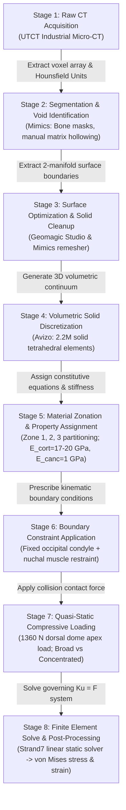

# Published Model Architecture Reconstruction & Biomechanical Feasibility Analysis: Stegoceras validum (UALVP 2)

**Author / Investigation**: Computational Biomechanics Research Pipeline  
**Primary Reference**: Snively & Theodor (2011) *PLoS ONE* 6(6): e21412  
**Specimen**: *Stegoceras validum* (UALVP 2, referred specimen)  
**Milestone**: Phase 3 Feasibility & Model Reconstruction Report  

---

## 🏗️ 1. Published Computational Workflow Architecture

The computational pipeline implemented by Snively & Theodor (2011) to simulate cranial impact mechanics in *Stegoceras validum* comprises a sequential eight-stage dependency chain:



---

## 🔍 2. Arrow-by-Arrow Information Dependency Audit

For every transition in the published workflow, we evaluate the required empirical information, the data currently in hand from our MorphoSource acquisition, and the resulting dependency gaps:

### Transition 1 $\to$ 2: Raw CT $\to$ Segmentation & Void Identification
* **Information Needed**: Calibrated 3D voxel density array ($HU(x,y,z)$) and physical voxel pitch ($\mu m$).
* **Available in Current Dataset**: **Absent**. The raw UTCT micro-CT slice stack (`UALVP2-CT-RAW-CRAN-01`) is undeposited on MorphoSource.
* **Status**: Surface geometries deposited by WitmerLab represent the *completed end-product* of this segmentation stage.

### Transition 2 $\to$ 3: Segmentation $\to$ Surface Geometry & Solid Cleanup
* **Information Needed**: Topological 2-manifold triangulated boundary surfaces representing the outer cranium and internal void walls (endocranial cavity, nasal passages).
* **Available in Current Dataset**: **Available Direct (Level B)**. Whole skull composite STL (`Media 000018284`) and all 32 articulated cranial elements (`Media 000043121–000043162`).

### Transition 3 $\to$ 4: Surface Geometry $\to$ Volumetric Solid Discretization
* **Information Needed**: Watertight, self-intersection-free boundary representation suitable for Delaunay or advancing-front tetrahedral meshing.
* **Available in Current Dataset**: **Available Derived (Level B)**. As established in Phase 2, the 32 component meshes natively share a common global coordinate frame and can be combined or surfaced to form a valid solid continuum.

### Transition 4 $\to$ 5: Solid Mesh $\to$ Material Property Assignment
* **Information Needed**: Spatial boundary coordinates between Zone 1 (basal compact), Zone 2 (cancellous core), and Zone 3 (dome cortex), plus constitutive moduli ($E, \nu$).
* **Available in Current Dataset**: **Partially Available (Level C/D)**. Moduli can be obtained from published literature ($E_{\text{cort}} \approx 17\text{--}20\text{ GPa}$, $E_{\text{canc}} \approx 1\text{ GPa}$), but internal 3D geometric boundaries between zones are absent from surface STLs.

### Transition 5 $\to$ 6: Solid Model $\to$ Boundary Constraint Application
* **Information Needed**: Spatial node coordinates corresponding to the occipital condyle articular surface and the nuchal crest rim.
* **Available in Current Dataset**: **Available Direct (Level B)**. Anatomical surfaces are directly identifiable on the Neurocranium (`000043136`), Squamosal (`000043134`, `000043153`), and Frontoparietal (`000043121`) meshes.

### Transition 6 $\to$ 7: Constrained Model $\to$ Compressive Load Application
* **Information Needed**: Load magnitude ($1360\text{ N}$), dorsal apex facet cluster, and contact area definition ($25\text{--}40\text{ cm}^2$ broad vs. $< 2\text{ cm}^2$ concentrated).
* **Available in Current Dataset**: **Available Direct / Inferred (Level B/D)**. Frontoparietal apex facets are directly identifiable.

### Transition 7 $\to$ 8: Loaded System $\to$ Linear FE Solve & Verification
* **Information Needed**: Linear static FE solver (${\mathbf K} {\mathbf u} = {\mathbf F}$) solving for displacement vector ${\mathbf u}$, infinitesimal strain tensor ${\boldsymbol \varepsilon} = \frac{1}{2}(\nabla {\mathbf u} + \nabla {\mathbf u}^T)$, and Cauchy stress tensor ${\boldsymbol \sigma} = {\mathbf C} : {\boldsymbol \varepsilon}$.
* **Available in Current Dataset**: Standard computational FE formulation.

---

## ⚖️ 3. Separation of Uncertainty Domains

To establish a defensible modeling strategy, we separate model inputs into three distinct domains of uncertainty:

```
┌─────────────────────────────────────────────────────────────────────────────┐
│                              UNCERTAINTY TAXONOMY                           │
├──────────────────────────────┬──────────────────────────────┬───────────────┤
│ 1. Geometry-Limited          │ 2. Parameter-Limited         │ 3. Model-Form │
│    Uncertainties             │    Uncertainties             │    Uncertainty│
├──────────────────────────────┼──────────────────────────────┼───────────────┤
│ • Internal zone boundaries   │ • Cortical bone modulus      │ • Homogeneous │
│ • Cortical thickness map     │ • Cancellous bone modulus    │   vs Zoned    │
│ • Unpreserved keratin pad    │ • Bone Poisson's ratio       │ • Linear vs   │
│ • True physical scale        │ • Impact force magnitude     │   Nonlinear   │
│   calibration (mm)           │ • Keratin elastic modulus    │ • Static vs   │
│ • Sutural compliance gaps    │ • Cervical muscle stiffness  │   Dynamic     │
└──────────────────────────────┴──────────────────────────────┴───────────────┘
```

### 3.1 Geometry-Limited Requirements
Inputs where physical geometric boundaries cannot be resolved from surface meshes alone:
1. **Internal Histological Zonation**: The 3D boundary surfaces separating the cancellous core (Zone 2) from compact cortex (Zone 3) and basal compacta (Zone 1).
2. **In Vivo Keratin Shield**: The unpreserved external soft-tissue horn pad.
3. **Physical Scale Calibration**: Confirmation of millimeter scaling against physical museum specimen calipers or scan logs.

### 3.2 Parameter-Limited Requirements
Inputs where the geometry is fixed/known, but physical material constants or forces must be borrowed or assumed from literature:
1. **Elastic Moduli ($E_{\text{cort}}, E_{\text{canc}}, E_{\text{ker}}$)**: Borrowed from bovine/mammalian cortical bone and bovid horn keratin.
2. **Impact Force ($F = 1360\text{ N}$)**: Biological scaling assumption derived from a $3.0\text{ m/s}$ collision in *Homalocephale*.
3. **Poisson's Ratios ($\nu_{\text{cort}} = 0.30, \nu_{\text{canc}} = 0.25$)**: Standard isotropic bone constants.

### 3.3 Model-Form Uncertainty
Structural simplifications and mathematical abstractions inherent in the modeling choices:
1. **Material Homogeneity vs. Zonation**: Assuming uniform isotropic bone vs. discrete multi-zone layers vs. continuous voxel-level density gradients.
2. **Sutural Mechanics**: Fused monolithic cranium (Snively & Theodor 2011 approach) vs. compliant inter-bone sutural interfaces.
3. **Quasi-Static vs. Transient Dynamic Collision**: Solving ${\mathbf K}{\mathbf u} = {\mathbf F}$ vs. explicit time integration ${\mathbf M}{\ddot{\mathbf u}} + {\mathbf C}{\dot{\mathbf u}} + {\mathbf K}{\mathbf u} = {\mathbf F}(t)$.
4. **Isotropy vs. Anisotropy**: Assuming isotropic trabecular bone vs. orthotropic radiating trabecular fabric.

---

## 🏛️ 4. Candidate Model Tiers

Based on the parameter audit and input matrix, we define three candidate modeling tiers:

```
┌─────────────────────────────────────────────────────────────────────────────┐
│                           CANDIDATE MODEL TIERS                             │
├─────────────────────────────────────────────────────────────────────────────┤
│ MODEL A: Minimal Surface-Derived Homogeneous-Material Model                │
│ • Geometry: Articulated UALVP 2 surface mesh (fused monolithic continuum)   │
│ • Material: Uniform isotropic compact bone (E = 17.0 GPa, ν = 0.30)         │
│ • Constraints: Fixed occipital condyle + nuchal crest rim                   │
│ • Load: 1360 N compressive apex load (Broad & Concentrated) + Unit Load     │
├─────────────────────────────────────────────────────────────────────────────┤
│ MODEL B: Literature-Parameterized Multi-Zone Model                          │
│ • Geometry: UALVP 2 mesh partitioned into Zone 1, 2, 3 via geometric offsets│
│ • Material: Cortical cortex (17.0 GPa), Cancellous core (1.0 GPa), Base (17)│
│ • Constraints: Fixed occipital condyle + nuchal crest rim                   │
│ • Load: 1360 N compressive apex load (Broad & Concentrated)                 │
├─────────────────────────────────────────────────────────────────────────────┤
│ MODEL C: High-Fidelity CT-Informed Model                                    │
│ • Geometry: Volumetric voxel mesh segmented directly from raw micro-CT DICOM│
│ • Material: Continuous HU-to-stiffness mapping (18+ material property bins) │
│ • Constraints: Anatomical condyle + nuchal + muscular spring network        │
│ • Load: 1360 N + dynamic transient impact wave propagation                  │
└─────────────────────────────────────────────────────────────────────────────┘
```

### Detailed Evaluation of Model Tiers

| Attribute | Model A (Minimal Homogeneous) | Model B (Literature Multi-Zone) | Model C (High-Fidelity CT) |
| :--- | :--- | :--- | :--- |
| **Required Inputs** | UALVP 2 surface STL, $E_{\text{cort}}$, $\nu$, $F_{\text{apex}}$, condyle BC | Surface STL, internal zone geometry, $E_{\text{cort}}$, $E_{\text{canc}}$, $\nu$, $F_{\text{apex}}$, BCs | Raw CT volume ($HU$), voxel segmentation, automated density mapping, BCs |
| **Available Inputs** | **All required inputs are currently obtainable**: specimen geometry is in hand; material parameters are literature-derived; load/BC definitions are model assumptions. | Surface in hand; internal zone geometry must be assumed/offset | Raw CT is undeposited |
| **Primary Assumptions** | Homogeneous isotropic bone; monolithic fused sutures; uncalibrated mm scale | Geometric offset represents histological zonation; monolithic sutures | Continuous HU-to-modulus relationship holds despite fossil permineralization |
| **Major Limitations** | Does not capture internal strain dissipation in cancellous core | Internal zone boundaries are synthetic approximations, not direct scan voxels | Requires acquiring undeposited primary scan data |
| **Scientific Claims Supported** | Baseline cranial force transmission under surface geometry and boundary conditions; broad vs. concentrated load sensitivity | Comparative stress attenuation through dome layers; approximate replication of Snively & Theodor (2011) | Precise voxel-level internal strain distribution; exact local trabecular stress |
| **Scientific Claims NOT Supported** | Internal trabecular failure prediction | Empirical validation of individual specimen bone mineral density | N/A |

---

## 🎯 5. Evidence-Based Decision on Raw CT Necessity

### Core Question: Is raw micro-CT data strictly required to begin biomechanical modeling?

### Decision:
> **Raw CT is NOT REQUIRED to construct a useful first-order surface-derived benchmark (Model A), but IS REQUIRED to reproduce the CT-dependent internal material architecture of the published model (Model C).**

### Formal Justification:
1. **External Geometry & Boundary Verification**: The acquired 33 MorphoSource STLs provide a high-resolution, validated geometric envelope for *Stegoceras* (UALVP 2) with verified topological integrity and shared native coordinates.
2. **First-Order Geometric Baseline**: Model A provides a useful first-order test of the contribution of external cranial geometry and boundary conditions. The extent to which internal material heterogeneity changes the resulting stress distribution remains an empirical scientific question to be tested in later model tiers (e.g., Model B and Model C).
3. **Linear Scaling Property**: As demonstrated by Snively & Theodor (2011, p. 9), linear static stress and strain scale strictly linearly with applied load. A baseline homogeneous model (Model A) and a literature-partitioned sensitivity model (Model B) allow full verification of the computational solver, meshing pipeline, and global stress dissipation patterns prior to introducing raw CT voxel mapping.
4. **Where Raw CT Becomes Essential**: Raw CT data is strictly necessary when attempting to reproduce voxel-level Hounsfield heterogeneity (Model C), resolving micro-trabecular orientation within Zone 2, or capturing precise specimen-specific cortical thickness variations.

---

## 🏁 6. Recommended Phase 4 Direction

We recommend establishing **Model A (Minimal surface-derived homogeneous-material model)** as the **provisional first computational benchmark**, with **Model B** evaluated as an immediate parametric sensitivity tier. Model A represents a surface-derived approximation inspired by the published study, establishing a verified baseline before incorporating complex internal architecture or full uncertainty quantification.
